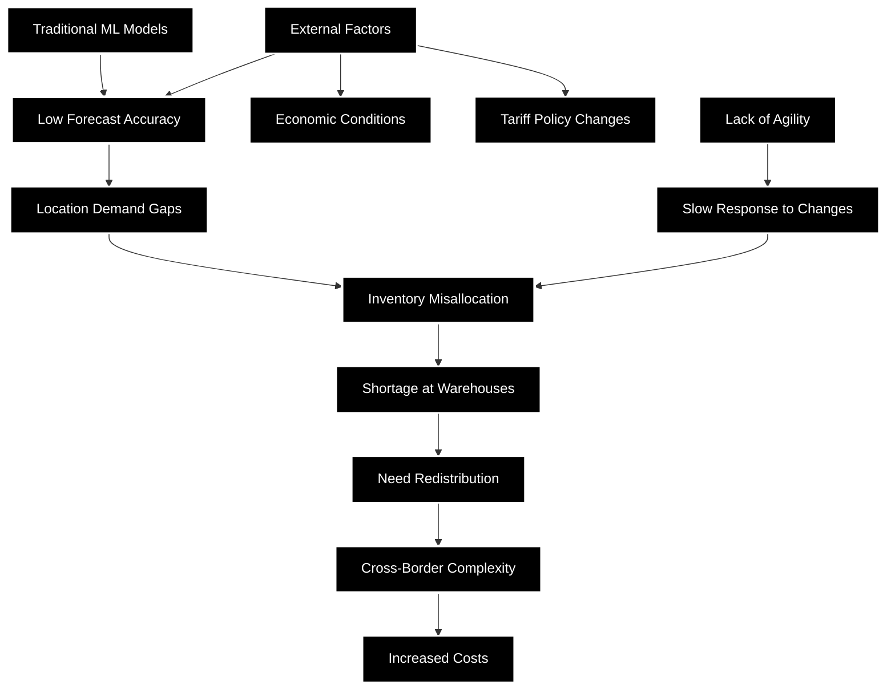

# Interview Notes

**Interview ID:** INT-001
**Date:** September 24, 2024
**Participant:** Anonymous Alumni
**Role:** Business Analyst
**Company Size:** Furniture & Home Furnishings Manufacturing, ~1000 employees, Global Operations
**Duration:** 1 hour

---

## 1. WORKFLOW UNDERSTANDING

### Current Workflow Diagram:

```mermaid
graph LR
    A[1-Year Forecast] --> B[Location-Based Demand Prediction]
    B --> C[Initial Inventory Allocation]
    C --> D{Forecast Accurate?}
    D -->|No| E[Reallocation Needed]
    E --> F[Identify Shortage Warehouses]
    F --> G[Find Source Warehouses]
    G --> H[Optimize Transfer Routes]
    H --> I[Execute Cross-Border Transfers]
    I --> J[Manage Tariff/Logistics Costs]
    D -->|Yes| K[Monitor & Maintain]

    style A fill:#000,color:#fff,stroke:#fff,stroke-width:2px
    style B fill:#000,color:#fff,stroke:#fff,stroke-width:2px
    style C fill:#000,color:#fff,stroke:#fff,stroke-width:2px
    style D fill:#000,color:#fff,stroke:#fff,stroke-width:2px
    style E fill:#000,color:#fff,stroke:#fff,stroke-width:2px
    style F fill:#000,color:#fff,stroke:#fff,stroke-width:2px
    style G fill:#000,color:#fff,stroke:#fff,stroke-width:2px
    style H fill:#000,color:#fff,stroke:#fff,stroke-width:2px
    style I fill:#000,color:#fff,stroke:#fff,stroke-width:2px
    style J fill:#000,color:#fff,stroke:#fff,stroke-width:2px
    style K fill:#000,color:#fff,stroke:#fff,stroke-width:2px
```


### Their Current Process:
```
Step 1: Design & forecast 1 year ahead (furniture long lead time)
Step 2: Predict quantity demand by location using traditional ML
Step 3: Allocate inventory to US & Canada warehouses
Step 4: Monitor actual vs forecast performance
Step 5: Reallocate inventory when gaps emerge
Step 6: Optimize redistribution between warehouses
```

### Planning (Pre-Season):
- MFP/Target Setting: 1-year advance planning due to furniture manufacturing lead times
- Forecasting Process: Location-based demand prediction using internal data
- Buying Process: Coordinated with long manufacturing cycles

### Execution (In-Season):
- Allocation Method: Distribution across US & Canada warehouses
- Sales Tracking: Monitored by data team
- Replenishment: Requires cross-border optimization when shortages occur

### Optimization (Continuous):
- Markdown Process: [To be discussed with planning team]
- Analytics/Reports: Internal data team provides reporting

---

## 2. PAIN POINTS

### Pain Points Flow Chart:


| Pain Point | How Often? | Time Lost | Severity (1-5) |
|------------|------------|-----------|----------------|
| Inaccurate demand forecasting with traditional ML | Ongoing | TBD | 5 |
| Location-specific demand prediction failures | Ongoing | TBD | 4 |
| Complex inventory redistribution decisions | Frequent | TBD | 4 |
| Cross-border transfer cost/time overhead | Per transfer | TBD | 3 |
| Inability to factor external economic factors | Ongoing | TBD | 4 |
| Lack of agility in forecast adjustments | Ongoing | TBD | 4 |

---

## 3. QUOTES TO REMEMBER

"Traditional numerical ML models don't provide enough accuracy and agility to predict demand"

"They want to adopt AI/LLMs to improve prediction accuracy, instead of only traditional machine learning models"

"When forecasts are off, they must quickly reallocate inventory"

---

## 4. MAGIC WAND QUESTION

If they could fix ONE thing:
Improve demand forecast accuracy with AI/LLM capabilities that can incorporate external factors

What would need to happen:
- Implement advanced AI models that capture economic conditions and policy changes
- Create more agile prediction system for location-based demand
- Reduce the cascading impact on inventory allocation


---

## 5. COLLABORATION OPPORTUNITY & NEXT STEPS

### Timing & Interest:
Planning team was already exploring agentic systems to integrate with their traditional ML models when we reached out. Interviewee was very interested in our multi-agent approach for demand forecasting.Business Analyst (interviewee) works separately from planning team, limiting detailed process knowledge

### Proposed Path Forward:
1. **MVP Development:** Develop a proof-of-concept multi-agent system for demand forecasting
2. **Stakeholder Access:** Upon MVP delivery, interviewee will facilitate introduction to Planning Team Manager
3. **Deep-Dive Sessions:** Multiple detailed sessions with planning team to understand:
   - Current workflow specifics
   - Integration requirements
   - Performance benchmarks
   - Success criteria

### Potential Long-term Collaboration:
- If MVP demonstrates value, company is open to continued collaboration beyond the independent study period
- Opportunity for real-world deployment and testing with actual data
- Potential for ongoing partnership post-graduation

---

## 6. QUICK NOTES / OBSERVATIONS

*Initial discovery meeting with Business Analyst who will facilitate connection to planning team*

### Key Insights:
- Company prefers to remain anonymous (competitive sensitivity around supply chain optimization)
- Furniture industry has unique challenges with long lead times (1 year planning horizon)
- Cross-border operations between US/Canada add significant complexity
- Current pain cascade: Poor forecast → Wrong allocation → Expensive redistribution
- Strong interest in AI/LLM solutions vs traditional ML
- Data team exists but current models insufficient

### Next Steps:
1. Deep dive with planning team on specific workflows
2. Quantify the cost impact of forecast inaccuracy
3. Map the full technology landscape
4. Understand integration points for potential AI solution