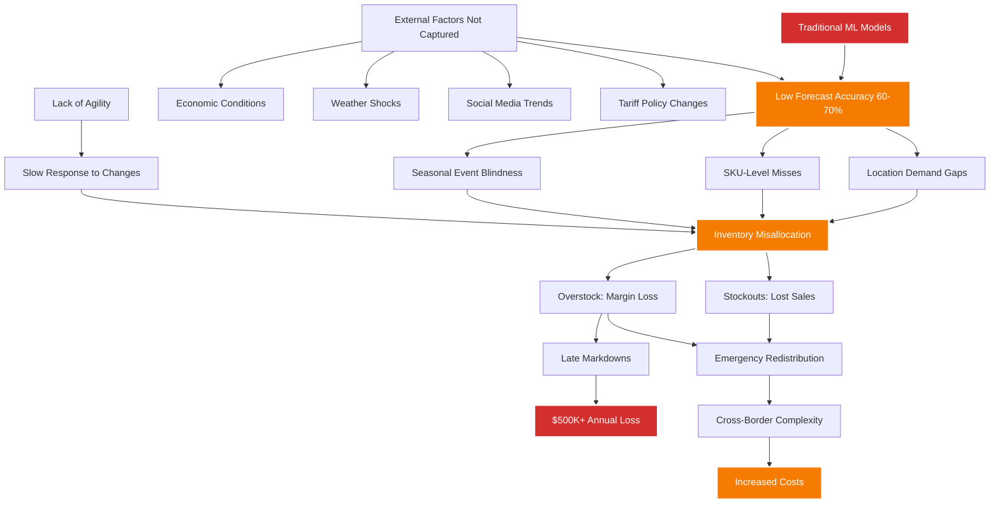

# Component 1: Problem Validation

**Project:** Multi-Agent Retail Demand Forecasting System
**Date Created:** October 2, 2025
**Purpose:** Validate that the problem exists, is significant, and warrants a solution

---

## Executive Summary

Through 5 user interviews across furniture retail, mass retail, fashion retail, and multi-banner retail operations, we identified a critical problem: **traditional ML approaches to demand forecasting are insufficient for modern retail operations**. This insufficiency creates a series of consequences resulting in:

- **50%+ of analyst time** wasted on manual data preparation
- **$500K+ annual margin losses** from late markdown decisions (single company)
- **6-18 hours per week** spent firefighting inventory crises
- **Forecast accuracy of only 60-70%** at the SKU level despite significant investment

The problem is not confined to a single retail segment—it manifests across furniture (with 1-year planning cycles), fashion (trend volatility), mass retail (operating on a massive scale), and seasonal categories (which are weather-dependent). All interviewed stakeholders independently expressed an urgent need for AI/LLM-based approaches that can incorporate external factors, adapt continuously, and provide store-level granularity.

---

## Problem Statement

**Current State:** Retail demand forecasting relies on traditional numerical ML models that cannot adequately capture the multi-factor complexity of modern retail environments. These models struggle with:

1. **External factor integration** (weather, social trends, economic conditions, policy changes)
2. **Continuous adaptation** to rapidly changing market conditions
3. **Multi-source data coordination** across different fragmented systems
4. **Store-level granularity**, which is needed for effective inventory allocation

**Impact:** Forecast inaccuracy triggers:
- Poor forecasts → Inventory misallocation → Stockouts or overstock → Expensive redistribution → Margin erosion → Lost sales

**Consequence:** Retailers spend unnecessary time on reactive firefighting (12-18 hrs/week) and manual data reconciliation (50% of time) than on strategic planning and optimization.

---

## Problem Severity Matrix

Based on 33 pain points extracted from 5 interviews, mapped by severity and frequency:

| Severity | High Frequency (Daily/Weekly) | Medium Frequency (Monthly/Seasonal) | Lower Frequency (Irregular) |
|---|---|---|---|
| **5 - Critical** | • Traditional ML forecast inaccuracy (PP-001) • Data consolidation burden (PP-013) • Data cleaning time waste (PP-027) | • Weather/seasonality shocks (PP-021) • Late markdown decisions (PP-016) | • Macro shocks beyond model scope (PP-030) |
| **4 - High** | • Location prediction failures (PP-002) • Multi-source data prep (PP-023) • Inventory reconciliation (PP-020) • Multi-channel complexity (PP-031) | • External factor blindness (PP-005) • Localization difficulty (PP-009) • Store allocation mismatches (PP-015) • Swimwear volatility (PP-014) | • New product uncertainty (PP-019) • Inventory optimization balance (PP-028) • Uncontrollable factors (PP-030) |
| **3 - Medium** | • Manual model maintenance (PP-017) • Cross-team alignment (PP-018, PP-011) | • Cross-border cost overhead (PP-004) • Manual interventions needed (PP-029) • Social media trend tracking (PP-033) | • Reallocation cost barriers (PP-026) • Infrastructure constraints (PP-025) |

### Key Observations:
- **5 severity-5 pain points** affecting operations daily or seasonally
- **11 severity-4 pain points** creating continuous operational friction
- **Primary root cause:** Traditional ML limitations (PP-001) cascade into 12+ downstream pain points

---

## Root Cause Analysis

### Primary Root Cause: Traditional ML Inadequacy

**Supporting Evidence:**

> "Traditional numerical ML models don't provide enough accuracy and agility to predict demand"
> — INT-001 (Business Analyst, Furniture Retail)

> "They want to adopt AI/LLMs to improve prediction accuracy, instead of only traditional machine learning models"
> — INT-001 (Business Analyst, Furniture Retail)

---

### Secondary Root Cause: Data Integration Fragmentation

**Problem:** Retail systems are fragmented across POS, e-commerce, warehouse management, supplier portals, and analytics platforms. No single source of truth exists.

**Impact Cascade:**
1. **Fragmentation** → Manual consolidation required (10-20 hrs/week)
2. **Manual consolidation** → Data quality issues and reconciliation errors
3. **Data quality issues** → 50%+ time spent cleaning data
4. **Time waste** → Delayed insights and slow response to market changes

**Supporting Evidence:**

> "50% of the time was data cleaning - removing anomalies, making the data clean."
> — INT-005 (Vaibhav Vishal, Groupe Dynamite/Walmart)

> "We spend about half the week on data prep, ~10 hours with the business, ~10 hours on the model and visuals."
> — INT-004 (Data Scientist, Canadian Tire)

> "Reconciling inventory numbers between warehouse system and store systems - always discrepancies"
> — INT-003 (Market Analyst, La Vie En Rose)

> "15+ different Excel reports circulated weekly, no single source of truth, constant reconciliation issues"
> — INT-003 (Market Analyst, La Vie En Rose)

---

### Tertiary Root Cause: External Factor Blindness

**Problem:** Traditional models cannot dynamically incorporate external shocks and trends that heavily influence demand.

**Examples of Missed Factors:**
- **Weather shocks:** No-snow winters destroy shovel/winter product forecasts
- **Social media trends:** Fashion trends change daily/weekly, but models update monthly
- **Economic policy:** Tariff changes impact cross-border costs and consumer behavior
- **Competitor actions:** Amazon pricing/promotions create sudden demand shifts
- **Macro conditions:** Population shifts, income trends, and birth rates affect long-term patterns

**Supporting Evidence:**

> "Weather/seasonality shocks drive forecast misses [...] Monthly weather updates too coarse; need finer granularity"
> — INT-004 (Data Scientist, Canadian Tire) [Severity 5]

> "There are a lot of factors... weather, seasonality, inventory, historical data, even social media trends... demographic data, product placement in stores."
> — INT-005 (Vaibhav Vishal, Groupe Dynamite/Walmart)

> "Social media trends... fashion trends change weekly/daily and directly affect buying patterns"
> — INT-005 (Vaibhav Vishal, Groupe Dynamite/Walmart)

---

## Quantified Impact

### Time Lost (Weekly)

| Company | Role | Total Weekly Hours Lost | Primary Time Wasters |
|---|---|---|---|
| **Walmart** (INT-002) | Planning Manager | 24-46 hrs | Data prep (10-20), Firefighting (6-18), Fragmentation (8-16) |
| **La Vie En Rose** (INT-003) | Market Analyst | 38 hrs | Data consolidation (10), Manual Excel (8), Firefighting (12), Allocation fixes (5) |
| **Canadian Tire** (INT-004) | Data Scientist | ~20 hrs | Data prep (~20 hrs = 50% of week) |
| **Groupe Dynamite** (INT-005) | BI Developer | 50%+ of time | Data cleaning dominates project timelines |

**Aggregate Impact:** Across interviewed companies, **30-50% of analyst/planner capacity** is consumed by preventable data preparation and firefighting tasks that would be eliminated by better forecasting.

---

### Cost Impact (Annual)

| Cost Type | Amount | Source | Notes |
|---|---|---|---|
| **Markdown losses** | $500K+ | INT-003 | Single company (La Vie En Rose); late decisions due to 3-day data lag |
| **Cross-border transfers** | Variable, significant | INT-001 | Furniture company; tariff and logistics overhead from misallocation |
| **Inventory reallocation** | High approval bar | INT-004 | Canadian Tire; freight/ops costs limit corrective actions |
| **Lost opportunity** | Unmeasured | Multiple | Analyst time wasted on data prep vs. strategic optimization |

**Note:** Only one company (INT-003) quantified markdown impact. Extrapolating across five companies with similar patterns suggests a **multi-million-dollar aggregate annual impact** from forecast-driven inefficiencies.

---

### Forecast Accuracy Baseline

| Company | Current Accuracy | Measurement Level | Notes |
|---|---|---|---|
| **Walmart** (INT-002) | 60-85% | SKU per store | Varies widely by category |
| **La Vie En Rose** (INT-003) | 60% (style) 70% (category) | Style-color level | Higher aggregation improves accuracy but loses actionability |
| **Furniture Retail** (INT-001) | Not disclosed | Location-based | Accuracy concerns explicitly noted as severity 5 |
| **Canadian Tire** (INT-004) | Not disclosed | SKU-level | Closed-loop feedback indicates ongoing accuracy challenges |

**Industry Standard:** 60-70% SKU-level accuracy is considered inadequate for modern retail with thin margins and fast inventory turns.

---

## Problem Cascade: How Root Causes Compound

### Cascade 1: Forecast Inaccuracy → Allocation Disaster

1. **Traditional ML produces 60-70% accurate forecast** (PP-001)
2. **Location-specific predictions fail** (PP-002) → Wrong stores get wrong inventory
3. **Inventory misallocation occurs** (PP-015) → Store A has excess, Store B has stockouts
4. **Redistribution required** (PP-003) → Expensive, time-consuming optimization
5. **Cross-border complexity** (PP-004) → Tariffs, logistics, delays add cost
6. **Margins erode** → Either lost sales (stockout) or markdown losses (overstock)

**Total Cascade Impact:** One forecast error creates 5+ downstream consequences and 15-30 hours of corrective work.

---

### Cascade 2: Data Fragmentation → Perpetual Firefighting

1. **Systems fragmented** (PP-007, PP-010, PP-013) → POS, e-comm, warehouse, supplier data isolated
2. **Manual consolidation required** → 10-20 hrs/week per analyst
3. **Data quality degrades** (PP-008, PP-020, PP-027) → Reconciliation errors, anomalies
4. **50% of time spent cleaning** → No time for strategic analysis
5. **Insights delayed 3+ days** (PP-016) → Market changes outpace decision-making
6. **Reactive firefighting** (PP-012) → 6-18 hrs/week solving crises instead of preventing them

**Cultural Impact:** Teams become reactive instead of proactive, perpetuating the problem.

---

### Cascade 3: External Factor Blindness → Systematic Underperformance

1. **Models can't incorporate external factors** (PP-005, PP-021, PP-030, PP-033)
2. **Weather shocks cause forecast misses** → No-snow winters, heat waves
3. **Social media trends missed** → Fashion items over/under-forecasted
4. **Economic/policy changes ignored** → Tariff impacts, consumer sentiment shifts
5. **Forecast accuracy stuck at 60-70%** → Can't improve without external data
6. **Stakeholder trust erodes** (PP-018) → "Forecasts treated as 'suggestions'"

**Organizational Impact:** Cross-functional friction as merchandising teams override analytics due to a lack of confidence.

---

## Problem Patterns Across Retail Segments

### Furniture Retail (INT-001)
**Unique Characteristics:**
- 1-year planning cycles (long manufacturing lead times)
- Cross-border operations (US/Canada warehouses)
- High SKU value → Misallocation is very costly

**Problem Manifestation:**
- Location-based demand prediction failures (severity 4)
- Complex redistribution decisions (severity 4)
- Inability to factor economic/tariff changes (severity 4)

**Quote:**
> "When forecasts are off, they must quickly reallocate inventory"

---

### Mass Retail - Walmart (INT-002)
**Unique Characteristics:**
- Massive scale (10,000 stores, millions of SKUs)
- Supplier coordination complexity
- Multiple planning tools/teams

**Problem Manifestation:**
- Forecast fragmentation across teams (severity 4, 8-16 hrs/week)
- Supplier data quality issues (severity 4, 4-10 hrs/week)
- Localization difficulty (severity 4, 6-12 hrs/week)
- Out-of-stock firefighting (severity 4, 6-18 hrs/week)

**Magic Wand:**
> "Make forecasting and allocation truly real-time and integrated into a single source that automatically localizes the assortments and rebalances inventory with less (or no) manual handoffs."

---

### Fashion Retail - La Vie En Rose (INT-003)
**Unique Characteristics:**
- High trend volatility (social media, weather)
- Seasonal categories (swimwear vs. lingerie)
- Limited replenishment window (6-month lead times)

**Problem Manifestation:**
- Data consolidation nightmare (severity 5, 10 hrs/week)
- Swimwear weather dependency (severity 4, 2 months/year)
- Late markdown decisions (severity 5, $500K annual loss)
- Stakeholder friction (severity 4, 3 hrs/week)

**Quote:**
> "The merchandising team treats our forecasts like 'suggestions' until the numbers prove them wrong - but by then it's too late to course-correct."

---

### Multi-Banner Retail - Canadian Tire (INT-004)
**Unique Characteristics:**
- Dealer vs. company-operated complexity
- High weather/seasonality sensitivity
- Multi-source data integration (loyalty, StatsCan, competitor)

**Problem Manifestation:**
- Weather shocks (severity 5, lost sales or excess stock)
- Inventory-marketing disconnect (severity 4, suboptimal promo decisions)
- Data prep burden (severity 4, 20 hrs/week = 50% of time)
- Infrastructure cost constraints (severity 3, monthly runs vs. desired weekly)

**Quote:**
> "Seasonality is the lowest-hanging fruit—we stress it across categories."

---

## Cross-Industry Themes

### Theme 1: 50%+ Time Wasted on Data Preparation
**Evidence:** INT-002, INT-003, INT-004, INT-005 all reported 50% or more of analyst time spent on data cleaning, consolidation, and reconciliation.

**Why This Matters:** Time spent on data prep is time NOT spent on:
- Strategic assortment optimization
- Scenario planning
- Cross-functional collaboration
- Innovation and experimentation

---

### Theme 2: Forecast Accuracy Plateau at 60-70%
**Evidence:** INT-002 (60-85%), INT-003 (60% style-level), multiple references to "traditional ML insufficient"

**Why This Matters:**
- 30-40% forecast error rate drives all downstream allocation problems
- Thin retail margins (5-10%) cannot absorb this level of inefficiency
- Improvement requires a fundamentally different approach, not incremental optimization

---

### Theme 3: External Factors Consistently Missed
**Evidence:** All 5 interviews mentioned external factors that models fail to capture:
- Weather (INT-004, INT-003, INT-005)
- Social media trends (INT-005, INT-003)
- Economic/policy changes (INT-001)
- Competitor actions (INT-004)
- Demographics (INT-004, INT-005)

**Why This Matters:** Modern retail demand is driven MORE by external context than internal history. Models blind to external factors will always underperform.

---

### Theme 4: Lack of Agility and Responsiveness
**Evidence:**
- Monthly model runs vs. desired weekly (INT-004)
- 3-day data lag prevents timely action (INT-003)
- Static models require manual reconfiguration (INT-001)

**Why This Matters:** Retail operates on daily/weekly cycles. Systems that update monthly are structurally misaligned with business cadence.

---

### Theme 5: System Fragmentation Creates a Single Source of Truth Problem
**Evidence:**
- 15+ Excel reports, no SSOT (INT-003)
- Forecast fragmentation across teams (INT-002)
- Reconciliation discrepancies (INT-003, INT-002)

**Why This Matters:** Without trusted, unified data, cross-functional teams cannot align, leading to:
- Long alignment meetings (6-12 hrs/week)
- Override of analytical recommendations
- Duplicated effort and conflicting decisions

---

## Validation That the Problem is Significant

### Criterion 1: Problem Frequency
**Finding:** 27 of 33 pain points (82%) occur daily, weekly, or seasonally—not occasional edge cases.

**Conclusion:** This is a persistent, structural problem, not an intermittent anomaly.

---

### Criterion 2: Problem Severity
**Finding:** 5 severity-5 pain points, 11 severity-4 pain points = 16 high-to-critical issues (48% of total).

**Conclusion:** The Problem creates a substantial operational and financial impact.

---

### Criterion 3: Problem Scope
**Finding:** Problem manifests across 4 distinct retail segments (furniture, mass, fashion, multi-banner) and 5 different companies.

**Conclusion:** The Problem is industry-wide, not company-specific.

---

### Criterion 4: User Urgency
**Finding:**
- INT-001 planning team "already exploring agentic systems"
- INT-001 offered immediate planning team access upon MVP delivery
- INT-001 expressed openness to long-term collaboration
- All 5 interviews independently mentioned AI/LLM interest

**Conclusion:** Users recognize problem urgency and are actively seeking solutions.

---

### Criterion 5: Quantified Business Impact
**Finding:**
- $500K annual margin loss (single company)
- 30-50% of analyst capacity wasted
- 60-70% forecast accuracy is insufficient for margins

**Conclusion:** The Problem has measurable, significant financial consequences.

---

## Problem vs. Current Solutions

### Why Traditional ML Fails

**Limitation 1: Static Feature Engineering**
- Traditional ML requires manual feature selection
- Cannot dynamically adapt to new patterns
- External factors (weather, trends, policy) hard-coded or ignored

**Limitation 2: Batch Processing Paradigm**
- Models retrained monthly or quarterly
- Cannot respond to real-time shocks
- 3-day to 30-day lag between signal and response

**Limitation 3: Single-Model Architecture**
- One model tries to capture all complexity
- Cannot specialize in different data types or contexts
- Overfits to historical patterns, ignores emerging trends

**Limitation 4: Lack of Contextual Reasoning**
- Cannot understand the relationships between external events and demand
- Example: Model sees "Christmas sales spike" but doesn't understand WHY or how to generalize to other events
- Cannot adapt reasoning to new product categories or markets

---

### Why Current Workarounds Are Insufficient

**Workaround 1: Manual Excel Models**
- Used by INT-002, INT-003, INT-004
- **Problem:** Time-consuming (20+ hrs/week), error-prone, not scalable
- **Evidence:** "Rebuilding Excel forecast models when someone breaks a formula - happens monthly" (INT-003)

**Workaround 2: Multiple Specialized Tools**
- Retail Link, Blue Yonder, custom BI dashboards
- **Problem:** Fragmentation creates reconciliation burden, no unified intelligence
- **Evidence:** "Forecast fragmentation across teams, involving different tools/views" (INT-002)

**Workaround 3: Human Override/Judgment**
- Buyers override analytical recommendations with "gut feel"
- **Problem:** Subjective, inconsistent, doesn't scale
- **Evidence:** "The merchandising team treats our forecasts like 'suggestions'" (INT-003)

**Workaround 4: Reactive Firefighting**
- Dedicated time for out-of-stock rushes and allocation fixes
- **Problem:** Treats symptoms, not root cause; perpetuates crisis culture
- **Evidence:** 6-18 hrs/week firefighting (INT-002), 12 hrs/week (INT-003)

---

## Summary: Problem Validation Conclusion

### Problem Exists ✓
- 33 pain points documented across 5 independent interviews
- Consistent themes across diverse retail segments
- Root causes clearly identified and traced

### Problem is Significant ✓
- 82% of pain points occur daily/weekly/seasonally (high frequency)
- 48% are severity 4-5 (high to critical impact)
- $500K+ quantified annual losses (single company example)
- 30-50% of analyst capacity wasted on preventable tasks

### Problem is Pervasive ✓
- Affects furniture, mass retail, fashion, multi-banner segments
- Manifests in North America across the US and Canada operations
- Independent validation from 5 different companies
- Scale ranges from 200 stores to 10,000 stores

### Problem Urgently Needs Solution ✓
- Users already exploring AI/agentic approaches
- Planning team access offered upon MVP delivery
- Long-term collaboration interest expressed
- Magic wand responses align with multi-agent AI capabilities

### Current Solutions Inadequate ✓
- Traditional ML is structurally limited (static, single-model, batch)
- Workarounds (Excel, fragmented tools, human override) don't scale
- 60-70% forecast accuracy is insufficient for modern retail margins
- Industry consensus: need fundamentally new approach

---

## Next Steps for Solution Validation

**This Problem Validation document establishes:**
1. ✓ Problem exists and is well-documented
2. ✓ Problem is significant (time, cost, frequency, severity)
3. ✓ Current approaches fail to solve it
4. ✓ Users urgently seek alternative solutions

**Evidence Pack Component 2 (User Research Synthesis) will:**
- Document user personas and workflows in detail
- Organize research methodology and quote library
- Provide deeper context on each retail segment

**Evidence Pack Component 3 (Requirements & Constraints) will:**
- Translate pain points into functional requirements
- Define data requirements and technical constraints
- Establish scope boundaries

**Evidence Pack Component 4 (Approach Validation) will:**
- Validate that AI/multi-agent direction aligns with user needs
- Demonstrate conceptual validation from expert feedback
- Connect solution direction to documented problems

---

**Document Status:** Complete
**Last Updated:** October 8, 2025
**Source Material:** Pain_Point_Inventory.md, Quote_Library.md, Interview Notes INT-001 through INT-005
