# Phase 4: Frontend/Backend Integration - Complete Overview

**Phase:** Phase 4 - Frontend/Backend Integration
**Status:** Ready for Implementation
**Approach:** Integration-First (Connect before building AI agents)
**Estimated Effort:** 48 hours (6 days)

---

## Table of Contents

1. [Executive Summary](#executive-summary)
2. [Features Working After Phase 4](#features-working-after-phase-4)
3. [System Architecture](#system-architecture)
4. [Complete Endpoint Mapping](#complete-endpoint-mapping)
5. [Frontend/Backend Integration Flow](#frontendbackend-integration-flow)
6. [Section-by-Section Integration Map](#section-by-section-integration-map)
7. [WebSocket Real-Time Integration](#websocket-real-time-integration)
8. [CSV Upload Integration](#csv-upload-integration)
9. [Data Flow Visualizations](#data-flow-visualizations)
10. [Testing Coverage](#testing-coverage)

---

## Executive Summary

### What is Phase 4?

Phase 4 implements a **complete frontend/backend integration** for all 8 dashboard sections using **mock agents with dynamic, parameter-driven behavior**. This validates the full stack before implementing real AI agents in Phases 5-7.

### Why Integration-First?

**Professor Feedback:**
- "Hook frontend and backend together first"
- "Repository too unstructured"
- Integration should happen BEFORE building agents

**Benefits:**
1. ✅ Validates communication layer early (reduces risk)
2. ✅ Tests parameter-driven architecture (v3.3)
3. ✅ Enables parallel agent development (Phases 5-7)
4. ✅ Better debugging (UI flows work before AI complexity)

### Key Metrics

| Metric | Value |
|--------|-------|
| **Dashboard Sections Integrated** | 8 sections (0-7) |
| **Backend API Endpoints** | 15+ endpoints |
| **Frontend Services** | 10 services |
| **Frontend Components** | 9 major components |
| **WebSocket Connections** | 1 real-time connection per workflow |
| **CSV Upload Endpoints** | 3 agent-specific upload endpoints |
| **Integration Tests** | 25+ tests (backend + frontend) |
| **Test Coverage** | >80% backend, >70% frontend |
| **Total Documentation** | ~10,000 lines |

---

## Features Working After Phase 4

### ✅ Core Features

#### 1. Natural Language Parameter Extraction
- **User Input:** "I need 8000 units over 12 weeks starting Jan 1, 2025. Weekly replenishment. 15% DC holdback."
- **System Output:** Structured `SeasonParameters` with 7 fields
- **Frontend:** Text input → "Extract Parameters" button
- **Backend:** OpenAI GPT-4o-mini extraction

#### 2. Real-Time Agent Status Updates
- **Technology:** WebSocket (not polling)
- **Update Frequency:** Instant (push-based)
- **Message Types:** 6 types (started, progress, completed, human_input_required, workflow_complete, error)
- **Reconnection:** Automatic with exponential backoff (max 5 attempts)

#### 3. Forecast Summary Dashboard
- **Metrics:** Total demand, safety stock %, DC holdback %, manufacturing order, MAPE
- **Visualization:** Stat cards with color-coded MAPE (green <15%, yellow 15-25%, red >25%)
- **Adaptation:** Mock agent adjusts safety stock based on replenishment strategy

#### 4. Store Cluster Analysis
- **Clusters:** 3 clusters (A, B, C) using K-means (mock data in Phase 4)
- **Visualization:** 3 cluster cards showing store count and average demand
- **Export:** CSV export functionality

#### 5. Weekly Performance Chart
- **Chart Type:** Composed chart (Recharts) with forecast line and actual bars
- **Variance Highlighting:** Color-coded (red >20%, yellow 10-20%, green <10%)
- **Interactivity:** Tooltip on hover with variance percentage

#### 6. Replenishment Queue (Conditional)
- **Display Rule:** Only shows if `replenishment_strategy !== "none"`
- **Content:** Store-level allocations with replenishment schedule
- **Format:** Table with store ID, allocated units, schedule

#### 7. Markdown Decision Analysis (Conditional)
- **Display Rule:** Only shows if `markdown_checkpoint_week !== null`
- **Formula:** Gap × Elasticity
- **Output:** Recommended markdown percentage, expected sell-through, risk assessment

#### 8. Performance Metrics Dashboard
- **Metrics:** MAPE, average variance, sell-through %
- **System Status:** Healthy / Moderate / Needs Attention (aggregates all 3 metrics)
- **Visualization:** 3 metric cards with color coding

#### 9. CSV Upload Workflows
- **UI:** Drag-and-drop + file picker
- **Validation:** Frontend (size, extension) + Backend (headers, data types, row-level)
- **Error Reporting:** Detailed errors with row/column information + downloadable .txt report
- **Agents Supported:** Demand, Inventory, Pricing (3 separate upload tabs)

---

## System Architecture

### High-Level Architecture Diagram


### Technology Stack

#### Frontend
- **Framework:** React 18
- **Language:** TypeScript 5
- **Build Tool:** Vite 5
- **UI Library:** Shadcn/ui + Tailwind CSS
- **Charts:** Recharts
- **Tables:** TanStack Table
- **Testing:** Vitest + Testing Library + MSW

#### Backend
- **Framework:** FastAPI 0.115+
- **Language:** Python 3.11+
- **Package Manager:** UV
- **Database:** SQLite 3.45+
- **WebSocket:** FastAPI WebSocket (built-in)
- **Testing:** pytest + pytest-asyncio

---

## Complete Endpoint Mapping

### Overview Table

| # | Section | Backend Endpoint | Method | Frontend Service | Frontend Component | Status After Phase 4 |
|---|---------|------------------|--------|------------------|--------------------|--------------------|
| **0** | Parameter Gathering | `/api/parameters/extract` | POST | ParameterService | ParameterGathering | ✅ Fully Integrated |
| **1** | Agent Cards | `/api/workflows/{id}/stream` | WS | WebSocketService | AgentCards | ✅ Fully Integrated |
| **2a** | Forecast Summary | `/api/forecasts/{id}` | GET | ForecastService | ForecastSummary | ✅ Fully Integrated |
| **3a** | Cluster Cards | `/api/stores/clusters` | GET | ClusterService | ClusterCards | ✅ Fully Integrated |
| **3b** | Cluster CSV Export | `/api/stores/clusters/export` | GET | ClusterService | ClusterCards | ✅ Fully Integrated |
| **4a** | Weekly Chart | `/api/variance/{id}/week/{week}` | GET | VarianceService | WeeklyPerformanceChart | ✅ Fully Integrated |
| **5a** | Replenishment Queue | `/api/allocations/{id}` | GET | AllocationService | ReplenishmentQueue | ✅ Fully Integrated (Conditional) |
| **6a** | Markdown Decision | `/api/markdowns/{id}` | GET | MarkdownService | MarkdownDecision | ✅ Fully Integrated (Conditional) |
| **7a** | Performance Metrics | `/api/forecasts/{id}` | GET | PerformanceService | PerformanceMetrics | ✅ Fully Integrated |
| **7b** | Performance Metrics | `/api/variance/{id}/summary` | GET | PerformanceService | PerformanceMetrics | ✅ Fully Integrated |
| **7c** | Performance Metrics | `/api/allocations/{id}` | GET | PerformanceService | PerformanceMetrics | ✅ Fully Integrated |
| **8a** | CSV Upload (Demand) | `/api/workflows/{id}/demand/upload` | POST | UploadService | UploadModal | ✅ Fully Integrated |
| **8b** | CSV Upload (Inventory) | `/api/workflows/{id}/inventory/upload` | POST | UploadService | UploadModal | ✅ Fully Integrated |
| **8c** | CSV Upload (Pricing) | `/api/workflows/{id}/pricing/upload` | POST | UploadService | UploadModal | ✅ Fully Integrated |
| **-** | Workflow Status | `/api/workflows/{id}` | GET | ApiClient | (Multiple) | ✅ Fully Integrated |
| **-** | Health Check | `/api/health` | GET | ApiClient | (None) | ✅ Fully Integrated |

**Legend:**
- ✅ **Fully Integrated:** Frontend component calls backend endpoint, displays data, handles errors
- 🟡 **Conditional:** Only displays when specific parameters are set
- WS = WebSocket

---

## Frontend/Backend Integration Flow

### Complete Data Flow Diagram

```mermaid
sequenceDiagram
    participant U as User
    participant F as Frontend<br/>(React)
    participant S as Services<br/>(TypeScript)
    participant A as API Client<br/>(HTTP)
    participant B as Backend<br/>(FastAPI)
    participant DB as Database<br/>(SQLite)
    participant WS as WebSocket<br/>Server

    Note over U,DB: Section 0: Parameter Extraction
    U->>F: Enter natural language input
    F->>S: ParameterService.extractParameters(input)
    S->>A: POST /api/parameters/extract
    A->>B: HTTP Request
    B->>DB: Store workflow + parameters
    B-->>A: {workflow_id, parameters}
    A-->>S: Response
    S-->>F: Update state
    F-->>U: Display parameters + workflow_id

    Note over U,WS: Section 1: WebSocket Connection
    F->>S: WebSocketService.connect(workflow_id)
    S->>WS: ws://localhost:8000/api/workflows/{id}/stream
    WS->>DB: Read workflow status
    WS-->>S: {type: "agent_started", agent_name: "Demand Agent"}
    S-->>F: onMessage callback
    F-->>U: Update agent card (Pending → Running)

    loop Agent Progress Updates
        WS-->>S: {type: "agent_progress", progress: 45}
        S-->>F: onMessage callback
        F-->>U: Update progress bar (45%)
    end

    WS-->>S: {type: "agent_completed", result: {...}}
    S-->>F: onMessage callback
    F-->>U: Update agent card (Running → Completed)

    Note over U,DB: Sections 2-7: Data Fetching
    F->>S: ForecastService.getForecastSummary(workflow_id)
    S->>A: GET /api/forecasts/{id}
    A->>B: HTTP Request
    B->>DB: Query forecast data
    B-->>A: {total_demand, MAPE, ...}
    A-->>S: Response
    S-->>F: Update state
    F-->>U: Display forecast summary

    Note over U,DB: Section 8: CSV Upload
    U->>F: Drag & drop CSV file
    F->>S: UploadService.uploadFile(workflow_id, file)
    S->>A: POST /api/workflows/{id}/demand/upload (FormData)
    A->>B: HTTP Request (multipart/form-data)
    B->>B: Validate CSV (headers, data types)
    B->>DB: Store uploaded data
    B-->>A: {validation_status: "VALID", rows_uploaded: 50}
    A-->>S: Response
    S-->>F: Update state
    F-->>U: Display success message
```



---

## Section-by-Section Integration Map

### Detailed Integration for Each Section

#### Section 0: Parameter Gathering

```mermaid
graph LR
    A[User Input<br/>Textarea] -->|1. User types| B[ParameterGathering<br/>Component]
    B -->|2. Click Extract| C[ParameterService]
    C -->|3. POST request| D[/api/parameters/extract]
    D -->|4. OpenAI extraction| E[Backend Logic]
    E -->|5. Return data| F[{workflow_id,<br/>parameters}]
    F -->|6. Update state| B
    B -->|7. Display| G[Parameter Cards<br/>Display]

    style A fill:#e1f5ff
    style B fill:#ffe1e1
    style C fill:#ffe1e1
    style D fill:#e1ffe1
    style E fill:#e1ffe1
    style F fill:#f0f0f0
    style G fill:#e1f5ff
```

**Data Flow:**
1. User types: "I need 8000 units over 12 weeks starting Jan 1, 2025. Weekly replenishment."
2. User clicks "Extract Parameters"
3. `ParameterService.extractParameters(userInput)` called
4. POST to `/api/parameters/extract` with `{user_input: "..."}`
5. Backend uses OpenAI GPT-4o-mini to extract parameters
6. Backend returns `{workflow_id: "wf_abc123", parameters: {forecast_horizon_weeks: 12, ...}}`
7. Frontend displays parameters in cards

---

#### Section 1: Agent Cards (WebSocket)


**Message Types:**
1. `agent_started` → Card status: Pending → Running
2. `agent_progress` → Progress bar: 0% → 45% → 100%
3. `agent_completed` → Card status: Running → Completed ✅
4. `human_input_required` → Show input modal
5. `workflow_complete` → All cards marked complete
6. `error` → Card status: Error ❌

---

#### Sections 2-7: Data Fetching Pattern

**All sections follow the same pattern:**


**Section Mappings:**

| Section | Component | Service Method | Endpoint | Display |
|---------|-----------|----------------|----------|---------|
| **2** | ForecastSummary | `getForecastSummary(id)` | `/api/forecasts/{id}` | Stat cards |
| **3** | ClusterCards | `getClusters()` | `/api/stores/clusters` | 3 cluster cards |
| **4** | WeeklyPerformanceChart | `getWeeklyVariance(id, week)` | `/api/variance/{id}/week/{week}` | Recharts chart |
| **5** | ReplenishmentQueue | `getAllocations(id)` | `/api/allocations/{id}` | Table |
| **6** | MarkdownDecision | `getMarkdownAnalysis(id)` | `/api/markdowns/{id}` | Gap × Elasticity formula |
| **7** | PerformanceMetrics | `getPerformanceMetrics(id)` | Multiple endpoints | 3 metric cards |

---

#### Section 8: CSV Upload Workflow


**Validation Layers:**

| Layer | Location | Checks | Error Response |
|-------|----------|--------|----------------|
| **Frontend (Pre-Upload)** | `UploadService.validateFile()` | File size (<10MB), File extension (.csv), Not empty | JavaScript Error thrown immediately |
| **Backend (Post-Upload)** | `validate_csv()` function | Required columns present, Data types correct (integer, float, string), Row-level validation | HTTP 400 with `{validation_status: "INVALID", errors: [{row: 23, column: "sales_units", ...}]}` |

---

## WebSocket Real-Time Integration

### Connection Lifecycle


### Reconnection Strategy

**Exponential Backoff:**

| Attempt | Delay | Total Time Elapsed |
|---------|-------|-------------------|
| 1 | 2 seconds | 2s |
| 2 | 4 seconds | 6s |
| 3 | 8 seconds | 14s |
| 4 | 16 seconds | 30s |
| 5 | 32 seconds | 62s |
| **After 5** | **Show Error** | **User must retry manually** |

### Message Type Mapping


---

## CSV Upload Integration

### Multi-Agent Upload Architecture


### CSV File Requirements

| Agent | File Type | Required Columns | Data Types | Max Size |
|-------|-----------|------------------|------------|----------|
| **Demand** | sales_data.csv | store_id, week, sales_units, sales_revenue, inventory_on_hand | string, int, int, float, int | 10MB |
| **Demand** | store_profiles.csv | store_id, store_name, region, size_sqft, cluster_id | string, string, string, int, string | 10MB |
| **Inventory** | dc_inventory.csv | sku, dc_location, available_units, reserved_units | string, string, int, int | 10MB |
| **Inventory** | lead_times.csv | store_id, lead_time_days | string, int | 10MB |
| **Inventory** | safety_stock.csv | store_id, safety_stock_percentage | string, float | 10MB |
| **Pricing** | markdown_history.csv | product_id, markdown_date, markdown_percentage, sales_lift | string, date, float, float | 10MB |
| **Pricing** | elasticity.csv | product_id, elasticity_coefficient | string, float | 10MB |

---

## Data Flow Visualizations

### Complete User Journey


### Parameter-Driven Behavior Flow

```mermaid
graph TD
    A[User Input] -->|Extract| B[SeasonParameters]
    B -->|Contains| C{replenishment_strategy}
    B -->|Contains| D{markdown_checkpoint_week}

    C -->|= none| E[Section 5 HIDDEN]
    C -->|= weekly or bi-weekly| F[Section 5 DISPLAYED]

    D -->|= null| G[Section 6 HIDDEN<br/>Backend returns 404]
    D -->|= 6| H[Section 6 DISPLAYED<br/>Backend returns markdown data]

    F -->|Affects| I[ReplenishmentQueue<br/>Shows allocations]
    H -->|Affects| J[MarkdownDecision<br/>Shows Gap × Elasticity]

    B -->|Affects| K[Mock Demand Agent]
    K -->|Adjusts| L[Safety Stock %]
    L -->|If strategy=none| M[25% safety stock]
    L -->|If strategy≠none| N[20% safety stock]

    style A fill:#e1f5ff
    style B fill:#f0f0f0
    style C fill:#fff3cd
    style D fill:#fff3cd
    style E fill:#ffc0c0
    style F fill:#c0ffc0
    style G fill:#ffc0c0
    style H fill:#c0ffc0
    style I fill:#e1f5ff
    style J fill:#e1f5ff
    style K fill:#e1ffe1
    style L fill:#f0f0f0
    style M fill:#ffe1e1
    style N fill:#ffe1e1
```



---

## Testing Coverage

### Backend Integration Tests

**Test Structure:**

```
backend/tests/integration/
├── test_parameters.py       # 4 tests
├── test_websocket.py        # 3 tests
├── test_forecasts.py        # 4 tests
├── test_allocations.py      # 2 tests
├── test_markdowns.py        # 2 tests
└── test_uploads.py          # 2 tests
────────────────────────────────
TOTAL: 17+ tests
```

**Coverage Breakdown:**

| Module | Lines | Covered | Coverage % | Target |
|--------|-------|---------|------------|--------|
| `app/api/parameters.py` | 50 | 45 | 90% | >80% ✅ |
| `app/api/workflows.py` | 60 | 52 | 87% | >80% ✅ |
| `app/api/forecasts.py` | 45 | 38 | 84% | >80% ✅ |
| `app/api/uploads.py` | 70 | 58 | 83% | >80% ✅ |
| `app/services/mock_agents.py` | 100 | 85 | 85% | >80% ✅ |
| **TOTAL** | **325** | **278** | **86%** | **>80% ✅** |

---

### Frontend Integration Tests

**Test Structure:**

```
frontend/src/tests/integration/
├── ParameterService.test.ts         # 2 tests
├── ForecastService.test.ts          # 2 tests
├── WebSocketService.test.ts         # 2 tests
├── components/
│   ├── ParameterGathering.test.tsx  # 2 tests
│   ├── AgentCards.test.tsx          # 1 test
│   └── UploadZone.test.tsx          # 1 test
────────────────────────────────────────
TOTAL: 10+ tests
```

**Coverage Breakdown:**

| Module | Lines | Covered | Coverage % | Target |
|--------|-------|---------|------------|--------|
| `src/services/*` | 400 | 310 | 78% | >70% ✅ |
| `src/components/*` | 800 | 580 | 73% | >70% ✅ |
| **TOTAL** | **1200** | **890** | **74%** | **>70% ✅** |

---

### Testing Pyramid

```mermaid
graph TD
    A[E2E Tests<br/>Phase 8<br/>Full user workflows]
    B[Integration Tests<br/>Phase 4<br/>Frontend ↔ Backend]
    C[Unit Tests<br/>Future<br/>Individual functions]

    A -->|Few, Slow, Expensive| B
    B -->|Some, Medium, Valuable| C
    C -->|Many, Fast, Cheap| D[Code]

    style A fill:#ffe1e1
    style B fill:#c0ffc0
    style C fill:#e1f5ff
    style D fill:#f0f0f0
```



**Phase 4 Focus:** Integration tests (middle layer)
- **Why?** Validates frontend/backend communication (Phase 4 goal)
- **Coverage:** >80% backend, >70% frontend
- **Tools:** pytest (backend), Vitest + MSW (frontend)

---

## Summary

### What Works After Phase 4

✅ **8 Dashboard Sections Fully Integrated**
✅ **15+ Backend API Endpoints Tested**
✅ **10 Frontend Services Created**
✅ **WebSocket Real-Time Updates**
✅ **CSV Upload with Validation**
✅ **Parameter-Driven Mock Agents**
✅ **Conditional Section Display**
✅ **25+ Integration Tests**
✅ **>80% Backend Coverage**
✅ **>70% Frontend Coverage**

### What Doesn't Work (By Design)

❌ **Real AI Forecasting** (Prophet/ARIMA) - Phase 5
❌ **Real Store Clustering** (K-means) - Phase 6
❌ **Real Markdown Optimization** - Phase 7
❌ **Error Handling Polish** - Phase 8
❌ **Performance Optimization** - Phase 8
❌ **Repository Cleanup** - Phase 8

### Next Steps After Phase 4

**Phase 5: Demand Agent Implementation**
- Replace mock Demand Agent with Prophet + ARIMA
- Keep all frontend/backend integration unchanged
- Endpoint `/api/forecasts/{id}` returns real data instead of mock

**Phase 6: Inventory Agent Implementation**
- Replace mock Inventory Agent with K-means clustering
- Keep all frontend/backend integration unchanged
- Endpoint `/api/stores/clusters` returns real clusters

**Phase 7: Pricing Agent Implementation**
- Replace mock Pricing Agent with markdown optimization
- Keep all frontend/backend integration unchanged
- Endpoint `/api/markdowns/{id}` returns real analysis

**Phase 8: End-to-End Testing & Cleanup**
- E2E tests with Playwright/Cypress
- Error handling polish
- Performance optimization
- Repository cleanup (remove unused files, organize structure)

---

## Quick Reference

### Key URLs

| Service | URL | Description |
|---------|-----|-------------|
| **Frontend** | http://localhost:5173 | React dashboard |
| **Backend API** | http://localhost:8000 | FastAPI server |
| **API Docs** | http://localhost:8000/docs | OpenAPI/Swagger |
| **WebSocket** | ws://localhost:8000/api/workflows/{id}/stream | Real-time updates |

### Key Commands

```bash
# Start Backend
cd backend
uvicorn app.main:app --reload

# Start Frontend
cd frontend
npm run dev

# Run Backend Tests
cd backend
pytest tests/integration/ -v --cov=app

# Run Frontend Tests
cd frontend
npm run test:coverage
```

### Key Files

| File | Purpose |
|------|---------|
| `implementation_plan.md` | High-level Phase 4 overview |
| `PHASE4_HANDOFF.md` | Getting started guide for developers |
| `PHASE4_OVERVIEW.md` | This file - complete feature and endpoint mapping |
| `checklist.md` | All acceptance criteria and tasks |
| `technical_decisions.md` | Architecture decisions with rationale |
| `stories/PHASE4-001.md` through `PHASE4-009.md` | Detailed implementation guides |

---

**Last Updated:** [DATE]
**Prepared By:** PM Agent (John)
**Version:** 1.0
