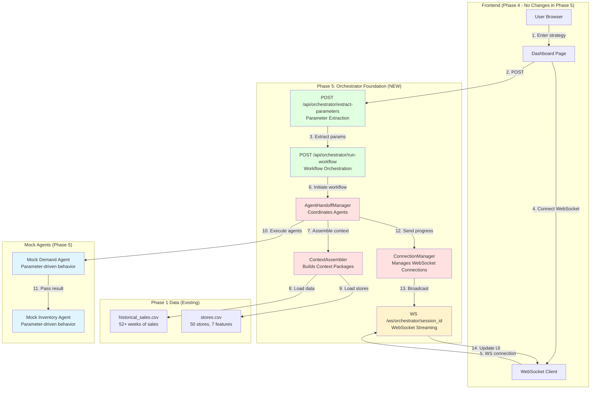
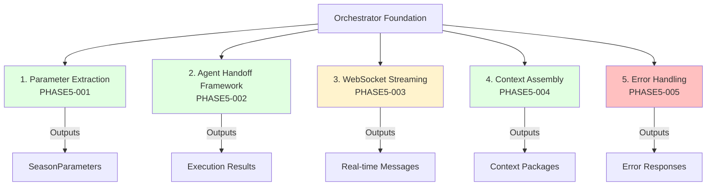
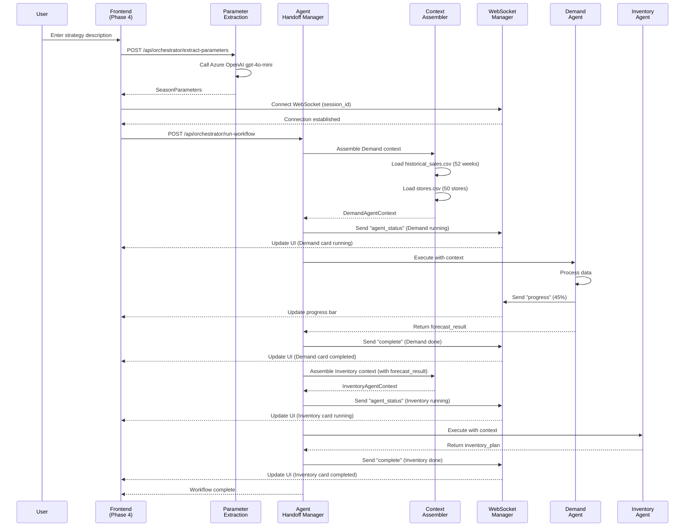
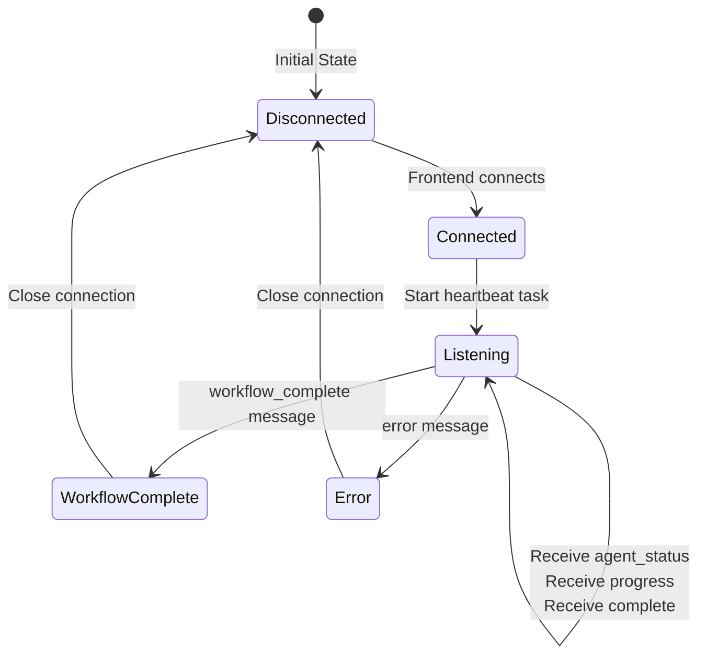
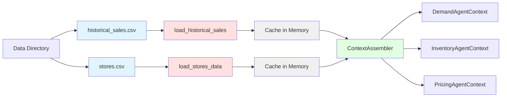

# Phase 5: Orchestrator Foundation - Complete Overview

**Phase:** Phase 5 - Orchestrator Foundation
**Status:** Ready for Implementation
**Approach:** Backend-Only Infrastructure (No Frontend Changes)
**Estimated Effort:** 28 hours (3.5 days)

**⚠️ Phase 4.5 Update:** This phase was updated to use database queries instead of CSV files after Phase 4.5 implemented data upload infrastructure. Historical sales and store data are now queried from SQLite database tables (`historical_sales`, `stores`) instead of loading from CSV files.

---

## Table of Contents

1. [Executive Summary](#executive-summary)
2. [Features Working After Phase 5](#features-working-after-phase-5)
3. [System Architecture](#system-architecture)
4. [Complete Endpoint Mapping](#complete-endpoint-mapping)
5. [Orchestrator Component Breakdown](#orchestrator-component-breakdown)
6. [Data Flow Visualizations](#data-flow-visualizations)
7. [Parameter Extraction Pipeline](#parameter-extraction-pipeline)
8. [Agent Handoff Framework](#agent-handoff-framework)
9. [WebSocket Message Flow](#websocket-message-flow)
10. [Context Assembly Pipeline](#context-assembly-pipeline)
11. [Testing Coverage](#testing-coverage)

---

## Executive Summary

### What is Phase 5?

Phase 5 implements the **Orchestrator Foundation** - the backend infrastructure that coordinates multi-agent workflows with parameter-driven behavior. This is the scaffolding that enables Phase 6-8 agents to plug in seamlessly.

### Why Orchestrator Foundation First?

**User Request:**
- "I want to build orchestrator foundation before building individual agents"
- Hybrid/incremental approach: Minimal orchestrator → Add agents one by one

**Benefits:**
1. ✅ Validates parameter-driven architecture early
2. ✅ Tests agent handoff framework before AI complexity
3. ✅ Enables incremental agent integration (one agent at a time)
4. ✅ Better debugging (orchestrator works before adding Prophet/ARIMA)
5. ✅ Lower risk (6 small stories vs 1 large orchestrator story)

### Key Metrics

| Metric | Value |
|--------|-------|
| **Backend Modules Created** | 5 modules (parameter_extraction, agent_handoff, websocket, context_assembly, error_handling) |
| **New API Endpoints** | 2 endpoints (extract-parameters, run-workflow) |
| **WebSocket Endpoint** | 1 real-time connection (ws://orchestrator/{session_id}) |
| **Data Models** | 8 Pydantic schemas (SeasonParameters, DemandAgentContext, etc.) |
| **Integration Tests** | 17+ tests |
| **Test Coverage Target** | >90% orchestrator module, >80% overall backend |
| **Total Documentation** | ~10,000 lines (6 detailed stories) |

---

## Features Working After Phase 5

### ✅ Core Features

#### 1. Natural Language Parameter Extraction
- **Input:** "I need 8000 units over 12 weeks starting Jan 1, 2025. Weekly replenishment. 15% DC holdback."
- **LLM Service:** Azure OpenAI gpt-4o-mini
- **Output:** Structured `SeasonParameters` with 5 required fields + 2 optional fields
- **Validation:** Business rules enforcement (4-52 weeks, 0-1 holdback percentage)
- **Error Handling:** 400 for incomplete extraction, 422 for invalid parameters, 503 for OpenAI errors

**API Endpoint:**
```http
POST /api/orchestrator/extract-parameters
Content-Type: application/json

{
  "strategy_description": "I need 8000 units over 12 weeks..."
}

Response 200 OK:
{
  "forecast_horizon_weeks": 12,
  "season_start_date": "2025-01-01",
  "season_end_date": "2025-03-26",
  "replenishment_strategy": "weekly",
  "dc_holdback_percentage": 0.15,
  "extraction_reasoning": "User specified 12 weeks, starting Jan 1...",
  "confidence_score": 0.95
}
```

---

#### 2. Agent Handoff Framework
- **Technology:** AgentHandoffManager class
- **Capabilities:**
  - Agent registration by name and handler function
  - Single agent execution with timeout enforcement (default 30s)
  - Agent chaining (result from Agent N → context for Agent N+1)
  - Execution logging (agent_name, duration, status)
- **Example Flow:** Demand Agent → Inventory Agent → Pricing Agent

**Code Example:**
```python
# Register agents
handoff_manager = AgentHandoffManager()
handoff_manager.register_agent("demand", demand_agent_handler)
handoff_manager.register_agent("inventory", inventory_agent_handler)

# Execute chain
result = await handoff_manager.handoff_chain(
    agents=["demand", "inventory"],
    initial_context={"parameters": params, "historical_data": df}
)
```

---

#### 3. WebSocket Real-Time Streaming
- **Technology:** FastAPI WebSocket (built-in)
- **Message Types:** 5 types (agent_status, progress, complete, error, heartbeat)
- **Connection:** ws://localhost:8000/ws/orchestrator/{session_id}
- **Heartbeat:** 30-second keepalive to prevent timeout
- **Concurrency:** Multiple connections supported (ConnectionManager)

**Message Flow:**
```json
// 1. Agent starts
{"type": "agent_status", "agent_name": "Demand Agent", "status": "running"}

// 2. Progress updates
{"type": "progress", "agent_name": "Demand Agent", "progress": 45, "message": "Loading historical data..."}

// 3. Agent completes
{"type": "complete", "agent_name": "Demand Agent", "result": {...}}

// 4. Error (if failure)
{"type": "error", "agent_name": "Demand Agent", "error_message": "Data not found"}

// 5. Heartbeat (every 30s)
{"type": "heartbeat", "timestamp": "2025-11-04T10:30:00Z"}
```

---

#### 4. Context-Rich Agent Handoffs
- **Technology:** ContextAssembler class + Database query loaders
- **Data Sources:**
  - Phase 4.5 Database tables (historical_sales, stores, categories)
  - Runtime parameters (SeasonParameters)
  - Previous agent results (for chaining)
- **Performance:** Context assembly completes in <2 seconds (with query caching)

**Three Context Types:**

**Demand Agent Context:**
```python
{
  "parameters": SeasonParameters,
  "historical_data": DataFrame,  # 52+ weeks of sales
  "stores_data": DataFrame,      # 50 stores, 7 features
  "category_id": "CAT001"
}
```

**Inventory Agent Context:**
```python
{
  "parameters": SeasonParameters,
  "forecast_result": {...},      # From Demand Agent
  "stores_data": DataFrame
}
```

**Pricing Agent Context:**
```python
{
  "parameters": SeasonParameters,
  "forecast_result": {...},      # From Demand Agent
  "inventory_plan": {...},       # From Inventory Agent
  "actuals_data": DataFrame      # Optional
}
```

---

#### 5. Comprehensive Error Handling
- **Custom Exceptions:** 7 exception classes (ParameterExtractionError, DataNotFoundError, AgentTimeoutError, etc.)
- **Standardized Responses:** ErrorResponse schema with error_type, message, details, suggestions
- **Request Tracing:** Request ID middleware for debugging
- **FastAPI Handlers:** Exception handlers for all custom exceptions
- **WebSocket Errors:** Error messages broadcast via WebSocket

**Example Error Response:**
```json
{
  "error_type": "PARAMETER_EXTRACTION_ERROR",
  "message": "Could not extract all required parameters",
  "details": {
    "missing_parameters": ["season_start_date", "dc_holdback_percentage"],
    "extracted_parameters": ["forecast_horizon_weeks", "replenishment_strategy"]
  },
  "suggestions": [
    "Specify the season start date (e.g., 'starting January 1, 2025')",
    "Specify the DC holdback percentage (e.g., '15% DC holdback')"
  ],
  "request_id": "req_abc123"
}
```

---

#### 6. Integration Testing Infrastructure
- **Framework:** pytest + pytest-asyncio
- **Coverage:** >90% orchestrator module, >80% overall backend
- **Test Types:**
  - Unit tests (individual functions)
  - Integration tests (full workflow)
  - WebSocket tests (real connection)
  - Performance tests (<10s workflow, <2s context assembly)
- **CI/CD:** Test execution in GitHub Actions

---

## System Architecture

### High-Level Architecture Diagram



### Technology Stack

#### Backend (Phase 5 Focus)
- **Framework:** FastAPI 0.115+
- **Language:** Python 3.11+
- **Package Manager:** UV
- **Database:** SQLite 3.45+
- **WebSocket:** FastAPI WebSocket (built-in)
- **LLM Service:** Azure OpenAI gpt-4o-mini
- **Data Processing:** pandas
- **Testing:** pytest + pytest-asyncio
- **Type Validation:** Pydantic v2

#### Frontend (Phase 4 - No Changes)
- **Framework:** React 18
- **Language:** TypeScript 5
- **WebSocket:** Already integrated in Phase 4

---

## Complete Endpoint Mapping

### New Endpoints in Phase 5

| # | Endpoint | Method | Purpose | Input | Output | Story |
|---|----------|--------|---------|-------|--------|-------|
| **1** | `/api/orchestrator/extract-parameters` | POST | Extract parameters from natural language | `{strategy_description: string}` | `SeasonParameters` | PHASE5-001 |
| **2** | `/api/orchestrator/run-workflow` | POST | Run complete orchestrator workflow | `{session_id: string, parameters: SeasonParameters}` | `{status: string, workflow_id: string}` | PHASE5-003 |
| **3** | `/ws/orchestrator/{session_id}` | WS | Real-time progress updates | WebSocket connection | 5 message types | PHASE5-003 |

### Existing Endpoints (Phase 4 - No Changes)

| # | Endpoint | Method | Purpose | Status |
|---|----------|--------|---------|--------|
| 1 | `/api/workflows/{id}/stream` | WS | WebSocket streaming (Phase 4) | ✅ Existing |
| 2 | `/api/forecasts/{id}` | GET | Get forecast results | ✅ Existing |
| 3 | `/api/stores/clusters` | GET | Get store clusters | ✅ Existing |
| 4 | `/api/allocations/{id}` | GET | Get allocations | ✅ Existing |
| 5 | `/api/markdowns/{id}` | GET | Get markdown analysis | ✅ Existing |

---

## Orchestrator Component Breakdown

### 5 Major Components



---

### Component 1: Parameter Extraction (PHASE5-001)

**File:** `backend/app/orchestrator/parameter_extraction.py`

**Responsibilities:**
1. Accept natural language input (10-500 characters)
2. Call Azure OpenAI gpt-4o-mini with few-shot prompt
3. Parse JSON response into SeasonParameters
4. Validate parameters against business rules
5. Return 400 for incomplete extraction
6. Return 422 for invalid parameters
7. Return 503 for OpenAI API errors

**Schemas:**
- `SeasonParameters` (Pydantic BaseModel)
- `ExtractionRequest` (Pydantic BaseModel)
- `ExtractionResponse` (Pydantic BaseModel)

**Endpoint:**
```python
@router.post("/extract-parameters", response_model=SeasonParameters)
async def extract_parameters(request: ExtractionRequest):
    # 1. Validate input length (10-500 chars)
    # 2. Call LLM with few-shot prompt
    # 3. Parse JSON response
    # 4. Validate parameters
    # 5. Return SeasonParameters or error
```

**Tests:**
- Test 1: Zara-style strategy (high fashion, short season)
- Test 2: Standard strategy (balanced parameters)
- Test 3: Luxury strategy (long season, no markdown)
- Test 4: Incomplete input (missing parameters)
- Test 5: Invalid parameters (out of range)

---

### Component 2: Agent Handoff Framework (PHASE5-002)

**File:** `backend/app/orchestrator/agent_handoff.py`

**Responsibilities:**
1. Maintain agent registry (name → handler mapping)
2. Execute single agent with timeout enforcement
3. Chain multiple agents (sequential execution)
4. Pass results from Agent N to Agent N+1
5. Log execution (agent_name, duration, status)
6. Handle timeouts gracefully
7. Handle agent errors

**Class:** `AgentHandoffManager`

**Methods:**
```python
class AgentHandoffManager:
    def register_agent(self, name: str, handler: Callable[[Any], Awaitable[Any]]):
        """Register an agent handler"""
        pass

    async def call_agent(
        self,
        agent_name: str,
        context: Any,
        timeout: int = 30
    ) -> Any:
        """Execute single agent with timeout"""
        pass

    async def handoff_chain(
        self,
        agents: List[str],
        initial_context: Any
    ) -> Any:
        """Execute agents sequentially, passing results"""
        pass

    def get_execution_log(self) -> List[ExecutionLogEntry]:
        """Get execution history"""
        pass
```

**Tests:**
- Test 1: Agent registration
- Test 2: Single agent execution
- Test 3: Agent chaining (Demand → Inventory)
- Test 4: Timeout enforcement
- Test 5: Agent errors
- Test 6: Execution logging
- Test 7: Multiple workflows concurrently

---

### Component 3: WebSocket Streaming (PHASE5-003)

**File:** `backend/app/orchestrator/websocket.py`

**Responsibilities:**
1. Manage WebSocket connections (ConnectionManager)
2. Accept connections at `/ws/orchestrator/{session_id}`
3. Broadcast 5 message types (agent_status, progress, complete, error, heartbeat)
4. Send heartbeat every 30 seconds
5. Close connections gracefully
6. Handle disconnects and reconnections

**Class:** `ConnectionManager`

**Methods:**
```python
class ConnectionManager:
    async def connect(self, websocket: WebSocket, session_id: str):
        """Accept new connection"""
        pass

    async def disconnect(self, session_id: str):
        """Close connection"""
        pass

    async def send_message(self, session_id: str, message: dict):
        """Send message to specific session"""
        pass

    async def broadcast(self, message: dict):
        """Broadcast to all connections"""
        pass
```

**Message Schemas:**
```python
class AgentStatusMessage(BaseModel):
    type: Literal["agent_status"]
    agent_name: str
    status: str  # "running" | "completed" | "failed"

class ProgressMessage(BaseModel):
    type: Literal["progress"]
    agent_name: str
    progress: int  # 0-100
    message: str

class CompleteMessage(BaseModel):
    type: Literal["complete"]
    agent_name: str
    result: dict

class ErrorMessage(BaseModel):
    type: Literal["error"]
    agent_name: str
    error_message: str

class HeartbeatMessage(BaseModel):
    type: Literal["heartbeat"]
    timestamp: datetime
```

**WebSocket Endpoint:**
```python
@router.websocket("/ws/orchestrator/{session_id}")
async def orchestrator_websocket(websocket: WebSocket, session_id: str):
    # 1. Accept connection
    # 2. Start heartbeat task
    # 3. Listen for messages
    # 4. Close connection on completion
```

**Workflow Endpoint:**
```python
@router.post("/run-workflow")
async def run_workflow(session_id: str, parameters: SeasonParameters):
    # 1. Validate parameters
    # 2. Assemble context
    # 3. Execute agent chain
    # 4. Send WebSocket updates during execution
    # 5. Return workflow result
```

---

### Component 4: Context Assembly (PHASE5-004)

**File:** `backend/app/orchestrator/context_assembly.py`

**Responsibilities:**
1. Load historical sales data from database (52+ weeks)
2. Load stores data from database (50 stores, 7 features)
3. Assemble Demand Agent context (parameters + historical + stores)
4. Assemble Inventory Agent context (parameters + forecast + stores)
5. Assemble Pricing Agent context (parameters + forecast + inventory + actuals)
6. Cache data to avoid repeated database queries
7. Complete assembly in <2 seconds

**Class:** `ContextAssembler`

**Methods:**
```python
class ContextAssembler:
    def __init__(self, db_session: Session):
        self.db = db_session
        self._historical_cache = None
        self._stores_cache = None

    def load_historical_sales(self, category_id: str = None) -> pd.DataFrame:
        """Load historical sales from database with caching"""
        pass

    def load_stores_data(self) -> pd.DataFrame:
        """Load stores from database with caching"""
        pass

    def assemble_demand_context(
        self,
        parameters: SeasonParameters,
        category_id: str
    ) -> DemandAgentContext:
        """Build Demand Agent context package"""
        pass

    def assemble_inventory_context(
        self,
        parameters: SeasonParameters,
        forecast_result: dict,
        stores_data: pd.DataFrame
    ) -> InventoryAgentContext:
        """Build Inventory Agent context package"""
        pass

    def assemble_pricing_context(
        self,
        parameters: SeasonParameters,
        forecast_result: dict,
        inventory_plan: dict,
        actuals_data: Optional[pd.DataFrame] = None
    ) -> PricingAgentContext:
        """Build Pricing Agent context package"""
        pass
```

**Data Models:**
```python
class DemandAgentContext(BaseModel):
    parameters: SeasonParameters
    historical_data: Any  # DataFrame converted to dict
    stores_data: Any      # DataFrame converted to dict
    category_id: str

class InventoryAgentContext(BaseModel):
    parameters: SeasonParameters
    forecast_result: dict
    stores_data: Any

class PricingAgentContext(BaseModel):
    parameters: SeasonParameters
    forecast_result: dict
    inventory_plan: dict
    actuals_data: Optional[Any] = None
```

---

### Component 5: Error Handling (PHASE5-005)

**File:** `backend/app/orchestrator/errors.py`

**Responsibilities:**
1. Define custom exception classes
2. Provide standardized error responses
3. Include helpful error messages and suggestions
4. Add request ID for tracing
5. Handle FastAPI exception conversion

**Custom Exceptions:**
```python
class OrchestratorError(Exception):
    """Base exception for orchestrator errors"""
    pass

class ParameterExtractionError(OrchestratorError):
    """Raised when parameter extraction fails"""
    pass

class DataNotFoundError(OrchestratorError):
    """Raised when required data files not found"""
    pass

class AgentTimeoutError(OrchestratorError):
    """Raised when agent execution times out"""
    pass

class AgentExecutionError(OrchestratorError):
    """Raised when agent execution fails"""
    pass

class ContextAssemblyError(OrchestratorError):
    """Raised when context assembly fails"""
    pass

class WebSocketConnectionError(OrchestratorError):
    """Raised when WebSocket connection fails"""
    pass

class InvalidParametersError(OrchestratorError):
    """Raised when parameters fail validation"""
    pass
```

**Error Response Schema:**
```python
class ErrorResponse(BaseModel):
    error_type: str
    message: str
    details: dict
    suggestions: List[str]
    request_id: str
```

**Exception Handlers:**
```python
@app.exception_handler(ParameterExtractionError)
async def parameter_extraction_error_handler(request, exc):
    return JSONResponse(
        status_code=400,
        content=ErrorResponse(
            error_type="PARAMETER_EXTRACTION_ERROR",
            message=str(exc),
            details={"missing_parameters": exc.missing_params},
            suggestions=["Specify the season start date", "..."],
            request_id=request.state.request_id
        ).dict()
    )
```

---

## Data Flow Visualizations

### Complete Orchestrator Flow



---

## Parameter Extraction Pipeline

### LLM Prompt Design

**Few-Shot Prompt Template:**
```python
PROMPT_TEMPLATE = """
You are a retail forecasting assistant. Extract season parameters from the user's strategy description.

Return a JSON object with these fields:
- forecast_horizon_weeks (int, 4-52): Number of weeks to forecast
- season_start_date (str, YYYY-MM-DD): Season start date
- season_end_date (str, YYYY-MM-DD): Calculated from start + horizon
- replenishment_strategy (str, "none"|"weekly"|"bi-weekly"): Replenishment frequency
- dc_holdback_percentage (float, 0.0-1.0): Percentage kept at DC

Examples:

User: "I need to forecast 8000 units for a 12-week spring season starting January 1, 2025. Weekly replenishment with 15% DC holdback."
Assistant: {
  "forecast_horizon_weeks": 12,
  "season_start_date": "2025-01-01",
  "season_end_date": "2025-03-26",
  "replenishment_strategy": "weekly",
  "dc_holdback_percentage": 0.15
}

User: {strategy_description}
Assistant:
"""
```

**Validation Rules:**
1. `forecast_horizon_weeks`: Must be 4-52 (1 month to 1 year)
2. `season_start_date`: Must be valid date in YYYY-MM-DD format
3. `season_end_date`: Must equal start_date + (horizon × 7 days)
4. `replenishment_strategy`: Must be "none", "weekly", or "bi-weekly"
5. `dc_holdback_percentage`: Must be 0.0-1.0 (0% to 100%)

---

## Agent Handoff Framework

### Agent Registration

```python
# Register mock agents
handoff_manager = AgentHandoffManager()

async def mock_demand_agent(context: DemandAgentContext) -> dict:
    # Simulate demand forecasting
    await asyncio.sleep(2)  # Simulate processing
    return {
        "total_demand": 8000,
        "safety_stock": 0.20,
        "forecast_by_week": [...]
    }

handoff_manager.register_agent("demand", mock_demand_agent)
```

### Sequential Execution

```python
# Chain agents
result = await handoff_manager.handoff_chain(
    agents=["demand", "inventory", "pricing"],
    initial_context={
        "parameters": params,
        "historical_data": df_sales,
        "stores_data": df_stores
    }
)

# Execution flow:
# 1. Demand Agent receives initial context
# 2. Demand Agent returns forecast_result
# 3. Inventory Agent receives {parameters, forecast_result, stores_data}
# 4. Inventory Agent returns inventory_plan
# 5. Pricing Agent receives {parameters, forecast_result, inventory_plan}
# 6. Pricing Agent returns final result
```

### Timeout Enforcement

```python
# Single agent with timeout
try:
    result = await handoff_manager.call_agent(
        agent_name="demand",
        context=context,
        timeout=30  # 30 seconds
    )
except AgentTimeoutError:
    # Handle timeout
    logger.error(f"Agent 'demand' timed out after 30 seconds")
```

---

## WebSocket Message Flow

### Connection Lifecycle



### Message Sending Pattern

```python
# During agent execution
async def execute_demand_agent(context, connection_manager, session_id):
    # 1. Send agent_status (running)
    await connection_manager.send_message(session_id, {
        "type": "agent_status",
        "agent_name": "Demand Agent",
        "status": "running"
    })

    # 2. Send progress updates
    for progress in [25, 50, 75, 100]:
        await connection_manager.send_message(session_id, {
            "type": "progress",
            "agent_name": "Demand Agent",
            "progress": progress,
            "message": f"Processing... {progress}%"
        })
        await asyncio.sleep(0.5)

    # 3. Send complete
    await connection_manager.send_message(session_id, {
        "type": "complete",
        "agent_name": "Demand Agent",
        "result": {...}
    })
```

---

## Context Assembly Pipeline

### Data Loading Flow



### Database Table Requirements (Phase 4.5)

| Table | Required Columns | Data Types | Min Rows |
|------|-----------------|------------|----------|
| **historical_sales** | week_start_date, store_id, category_id, units_sold | DATE, VARCHAR, VARCHAR, INTEGER | 52 (1 year) |
| **stores** | store_id, store_name, region, store_size_sqft, location_tier, median_income, store_format | VARCHAR, VARCHAR, VARCHAR, INTEGER, VARCHAR, INTEGER, VARCHAR | 50 |

### Performance Optimization

**Caching Strategy:**
- Query historical_sales table once → cache DataFrame in memory
- Query stores table once → cache DataFrame in memory
- Reuse cached data for all subsequent context assemblies
- Target: <1 second for first query, <100ms for cached loads

**Validation:**
- Verify database tables exist (historical_sales, stores, categories)
- Verify required columns present in query results
- Verify data types correct from SQLAlchemy models
- Verify minimum row count met (52 weeks for historical data)
- Raise DataNotFoundError if validation fails

**Database Connection:**
- Use SQLAlchemy Session for database queries
- Connection pooling handled by SQLAlchemy engine
- Database path: `sqlite:///./fashion_forecast.db` (configured in .env)

---

## Testing Coverage

### Integration Tests Structure

```
backend/tests/integration/orchestrator/
├── test_parameter_extraction.py       # 5 tests
├── test_agent_handoff.py              # 7 tests
├── test_websocket.py                  # 3 tests
├── test_context_assembly.py           # 4 tests
├── test_error_handling.py             # 5 tests
└── test_orchestrator_workflow.py      # 5 tests
──────────────────────────────────────────
TOTAL: 29+ tests
```

### Coverage Breakdown

| Module | Lines | Target Coverage | Critical Functions |
|--------|-------|----------------|-------------------|
| `orchestrator/parameter_extraction.py` | 80 | >95% | extract_parameters_from_text |
| `orchestrator/agent_handoff.py` | 120 | >95% | call_agent, handoff_chain |
| `orchestrator/websocket.py` | 100 | >90% | send_message, broadcast |
| `orchestrator/context_assembly.py` | 150 | >90% | assemble_demand_context |
| `orchestrator/errors.py` | 50 | >85% | exception_handlers |
| **TOTAL** | **500** | **>90%** | **All critical paths** |

### Performance Testing

**Targets:**
- Parameter extraction: <5 seconds (includes OpenAI API call)
- Context assembly (first load): <1 second
- Context assembly (cached): <100ms
- Complete workflow (3 agents): <10 seconds
- WebSocket message latency: <50ms

**Test Scenarios:**
```python
@pytest.mark.performance
async def test_workflow_performance():
    start = time.time()
    result = await orchestrator.run_workflow(params)
    duration = time.time() - start
    assert duration < 10.0, f"Workflow took {duration}s (target: <10s)"

@pytest.mark.performance
async def test_context_assembly_performance():
    assembler = ContextAssembler(data_dir="data")
    start = time.time()
    context = assembler.assemble_demand_context(params, category_id="CAT001")
    duration = time.time() - start
    assert duration < 2.0, f"Context assembly took {duration}s (target: <2s)"
```

---

## Summary

### What Works After Phase 5

✅ **Orchestrator Foundation Complete**
✅ **Parameter Extraction with Azure OpenAI**
✅ **Agent Handoff Framework Operational**
✅ **WebSocket Real-Time Streaming**
✅ **Context Assembly with Historical Data**
✅ **Comprehensive Error Handling**
✅ **Integration Testing Infrastructure**
✅ **>90% Orchestrator Coverage**
✅ **Performance Targets Met**

### What Doesn't Work (By Design)

❌ **Real AI Forecasting** (Prophet/ARIMA) - Phase 6 (Demand Agent)
❌ **Real Store Clustering** (K-means) - Phase 7 (Inventory Agent)
❌ **Real Markdown Optimization** - Phase 8 (Pricing Agent)

### Next Steps After Phase 5

**Phase 6: Demand Agent Implementation**
- Replace mock Demand Agent with Prophet + ARIMA ensemble
- Use orchestrator infrastructure (no changes to orchestrator)
- Receive DemandAgentContext from ContextAssembler
- Return forecast_result to orchestrator

**Phase 7: Inventory Agent Implementation**
- Replace mock Inventory Agent with K-means clustering + allocation
- Use orchestrator infrastructure (no changes to orchestrator)
- Receive InventoryAgentContext with forecast_result
- Return inventory_plan to orchestrator

**Phase 8: Pricing Agent Implementation**
- Replace mock Pricing Agent with markdown optimization
- Use orchestrator infrastructure (no changes to orchestrator)
- Receive PricingAgentContext with forecast + inventory
- Return final pricing recommendations

---

## Quick Reference

### Key URLs

| Service | URL | Description |
|---------|-----|-------------|
| **Backend API** | http://localhost:8000 | FastAPI server |
| **API Docs** | http://localhost:8000/docs | OpenAPI/Swagger |
| **WebSocket** | ws://localhost:8000/ws/orchestrator/{session_id} | Real-time updates |

### Key Commands

```bash
# Start Backend
cd backend
uvicorn app.main:app --reload

# Run Tests
cd backend
pytest tests/integration/orchestrator/ -v --cov=app.orchestrator

# Test WebSocket
wscat -c ws://localhost:8000/ws/orchestrator/test123
```

### Key Files

| File | Purpose |
|------|---------|
| `implementation_plan.md` | High-level Phase 5 overview |
| `PHASE5_HANDOFF.md` | Getting started guide for developers |
| `PHASE5_OVERVIEW.md` | This file - complete feature and architecture mapping |
| `stories/PHASE5-001.md` through `PHASE5-006.md` | Detailed implementation guides |

---

**Last Updated:** 2025-11-04
**Prepared By:** PM Agent (Product Owner)
**Version:** 1.0
