# Agent Coordination Workflow
**Multi-Agent Demand Forecasting System**

**Version:** 1.0
**Date:** 2025-10-10
**Archetype:** Archetype 2 - Stable Catalog Retail (26-week season)

---

## 1. Overview

This document describes how the **3 agents** (Demand, Inventory, Pricing) coordinate with each other through the **Orchestrator** to execute the 5-phase seasonal workflow.

### 1.1 Agent Roles Summary

| Agent | Primary Responsibility | Key Output |
|-------|----------------------|-----------|
| **Demand Agent** | Predict store-week demand | `demand_by_store_by_week` matrix |
| **Inventory Agent** | Calculate manufacturing orders, allocate inventory, plan replenishment | Manufacturing order, allocation plans, replenishment schedules |
| **Pricing Agent** | Monitor sell-through, recommend markdowns | Markdown triggers, depth recommendations |
| **Orchestrator** | Coordinate agents, trigger workflows, monitor performance | Agent execution sequence, performance metrics |

---

## 2. Coordination Architecture

### 2.1 Communication Pattern

The agents communicate through **message passing** coordinated by the Orchestrator.

The Orchestrator receives triggers (time-based or event-based), determines which agents to invoke, passes data between agents, and monitors outputs to trigger next steps.

The communication flows from Orchestrator to each of the three agents (Demand, Inventory, Pricing), with the Pricing Agent able to trigger the Demand Agent for re-forecasting when markdowns are needed.

**Key Principles:**
- **Sequential execution**: Agents run in order (Demand → Inventory → Pricing)
- **Data dependencies**: Each agent waits for previous agent's output
- **Orchestrator control**: No direct agent-to-agent communication
- **State management**: Orchestrator maintains workflow state

---

## 3. Phase-by-Phase Coordination

### 3.0 Coordination Flowcharts

The following flowcharts illustrate the coordination between agents across different phases and scenarios.

#### 3.0.1 Overall Season Workflow

```mermaid
flowchart TD
    Start([Season Start]) --> Phase1[Phase 1: Pre-Season Planning<br/>Week -12]
    Phase1 --> Phase2[Phase 2: Initial Allocation<br/>Week 0]
    Phase2 --> Phase3[Phase 3: In-Season Operations<br/>Weeks 2-10]
    Phase3 --> Phase4[Phase 4: Mid-Season Pricing<br/>Week 12]
    Phase4 --> Phase3b[Continue In-Season<br/>Weeks 14-26]
    Phase3b --> Phase5[Phase 5: Season End<br/>Week 26]
    Phase5 --> End([Season Complete])
```

#### 3.0.2 Phase 1: Pre-Season Planning Flow

#### 3.0.3 Phase 3: In-Season Operations (Bi-Weekly Cycle)

#### 3.0.4 Phase 4: Mid-Season Pricing (Week 12)

#### 3.0.5 Variance-Triggered Emergency Re-forecast

#### 3.0.6 Agent Communication Protocol

#### 3.0.7 Decision Tree: When to Invoke Each Agent

---

### Phase 1: Pre-Season Planning (Week -12, 3 months before season)

**Trigger**: Time-based (12 weeks before season start)

**Workflow:**

1. Orchestrator detects Week -12 and invokes the Demand Agent
2. Demand Agent receives SKU attributes for 50 SKUs and outputs demand_by_store_by_week matrix (50 stores × 26 weeks × 50 SKUs)
3. Orchestrator passes forecast to Inventory Agent
4. Inventory Agent calculates total demand, applies 15% safety stock, and determines manufacturing order quantity
5. Orchestrator stores all outputs (demand_by_store_by_week, manufacturing_order, confidence_scores) and sets next trigger for Week 0

**Data Flow:**
1. **Orchestrator** → **Demand Agent**: Send SKU attributes
2. **Demand Agent** → **Orchestrator**: Return forecast + confidence
3. **Orchestrator** → **Inventory Agent**: Send forecast
4. **Inventory Agent** → **Orchestrator**: Return manufacturing order
5. **Orchestrator**: Store all outputs, wait for Week 0

**Agent Coordination Details:**
- **Demand Agent runs once** per SKU (50 total runs)
- **Inventory Agent runs after** all demand forecasts complete
- **No Pricing Agent** involvement at this stage

---

### Phase 2: Season Start - Initial Allocation (Week 0)

**Trigger**: Time-based (Season start date)

**Workflow:**

1. Orchestrator detects Week 0 and invokes Inventory Agent in allocation mode
2. Inventory Agent receives demand_by_store_by_week for weeks 0-1
3. Inventory Agent calculates store allocation (demand × 1.10 safety buffer) and DC holdback
4. Orchestrator stores initial allocation plan and DC holdback inventory
5. Orchestrator sets next trigger for Week 2 (bi-weekly replenishment)

**Data Flow:**
1. **Orchestrator** → **Inventory Agent**: Send forecast (weeks 0-1) + manufacturing order
2. **Inventory Agent** → **Orchestrator**: Return allocation plan
3. **Orchestrator**: Store allocation, set next trigger (Week 2)

**Agent Coordination Details:**
- **Only Inventory Agent** runs
- Uses previously stored `demand_by_store_by_week` from Phase 1
- **No re-forecasting** at this stage

---

### Phase 3: In-Season Operations (Weeks 2, 4, 6, 8, 10)

**Trigger**: Time-based (every 2 weeks) OR Event-based (variance > 15%)

**Workflow:**

1. Orchestrator detects Week N (N=2,4,6,8,10) or variance exceeding 15%
2. Orchestrator calculates variance: (actual_sales - forecast) / forecast × 100
3. **IF variance > 15%**: Invoke Demand Agent for re-forecast
   - Demand Agent receives actual sales (weeks 0 to N) and remaining weeks
   - Demand Agent outputs updated demand_by_store_by_week (weeks N+1 to 26)
4. **ELSE**: Skip to Inventory Agent with original forecast
5. Inventory Agent receives demand forecast for next 2 weeks + current inventory
6. Inventory Agent calculates target inventory and replenishment quantities
7. Orchestrator stores replenishment plan and sets next trigger

**Data Flow (Normal Bi-weekly):**
1. **Orchestrator** → **Inventory Agent**: Send forecast (next 2 weeks) + current inventory
2. **Inventory Agent** → **Orchestrator**: Return replenishment plan
3. **Orchestrator**: Store plan, set next trigger

**Data Flow (Variance-Triggered Re-forecast):**
1. **Orchestrator** detects variance > 15%
2. **Orchestrator** → **Demand Agent**: Send actual sales + remaining weeks
3. **Demand Agent** → **Orchestrator**: Return updated forecast
4. **Orchestrator** → **Inventory Agent**: Send updated forecast + current inventory
5. **Inventory Agent** → **Orchestrator**: Return replenishment plan
6. **Orchestrator**: Store updated forecast + plan

**Agent Coordination Details:**
- **Conditional Demand Agent invocation**: Only if variance > 15%
- **Inventory Agent always runs**: Even without re-forecast
- **Sequential dependency**: If Demand Agent runs, Inventory Agent waits

---

### Phase 4: Mid-Season Pricing (Week 12)

**Trigger**: Time-based (Week 12)

**Workflow:**

1. Orchestrator detects Week 12 and invokes Pricing Agent
2. Pricing Agent receives actual sales (weeks 0-12) and manufacturing order
3. Pricing Agent calculates sell-through percentage (cumulative_sales / manufacturing_order)
4. **IF sell_through < 50%**: Recommend markdown and calculate depth (10%, 20%, or 30%)
5. **IF markdown recommended**: Orchestrator invokes Demand Agent for re-forecast
   - Demand Agent applies demand lift based on markdown depth and elasticity factor
   - Demand Agent outputs updated forecast for weeks 13-26
6. Orchestrator invokes Inventory Agent with updated forecast
7. Inventory Agent recalculates replenishment plan for weeks 14-26
8. Orchestrator stores all outputs and sets next trigger for Week 14

**Data Flow (No Markdown Needed):**
1. **Orchestrator** → **Pricing Agent**: Send actuals + manufacturing order
2. **Pricing Agent** → **Orchestrator**: Return "no markdown needed"
3. **Orchestrator**: Store result, continue to Week 14

**Data Flow (Markdown Recommended):**
1. **Orchestrator** → **Pricing Agent**: Send actuals + manufacturing order
2. **Pricing Agent** → **Orchestrator**: Return markdown recommendation + depth
3. **Orchestrator** → **Demand Agent**: Send markdown depth + remaining weeks
4. **Demand Agent** → **Orchestrator**: Return updated forecast (weeks 13-26)
5. **Orchestrator** → **Inventory Agent**: Send updated forecast
6. **Inventory Agent** → **Orchestrator**: Return updated replenishment plan
7. **Orchestrator**: Store all outputs

**Agent Coordination Details:**
- **Pricing Agent triggers Demand Agent**: Conditional cascade
- **3-agent sequence**: Pricing → Demand → Inventory (if markdown triggered)
- **Orchestrator manages conditional logic**: Not all agents run every time

---

### Phase 5: Season End (Week 26)

**Trigger**: Time-based (End of season)

**Workflow:**

1. Orchestrator detects Week 26 and begins final analytics
2. Orchestrator calculates performance metrics:
   - MAPE (Mean Absolute Percentage Error)
   - Bias (over/under-forecasting tendency)
   - Final sell-through percentage
   - Confidence calibration
3. Orchestrator generates season summary report with:
   - MAPE by SKU, by store, and overall
   - Bias analysis
   - Sell-through by SKU
   - Leftover inventory by store
   - Total markdown cost impact
4. Orchestrator stores season summary report

**Data Flow:**
1. **Orchestrator**: Aggregate all stored data (forecasts, actuals, allocations)
2. **Orchestrator**: Calculate performance metrics
3. **Orchestrator**: Generate season summary report
4. **No agent invocations**: Pure data processing

**Agent Coordination Details:**
- **No agents run**: Orchestrator-only phase
- **Pure analytics**: Calculate accuracy, bias, performance

---

## 4. Event-Based Coordination

### 4.1 Variance-Triggered Re-forecast

**Trigger**: variance > 15% at any week

**Coordination Logic:**

The Orchestrator continuously monitors variance by comparing actual sales to forecasted demand. When variance exceeds 15%, an emergency re-forecast is triggered.

**Process:**
1. Orchestrator detects variance > 15% at a specific week
2. Orchestrator alerts that high variance has been detected
3. Orchestrator invokes Demand Agent with actual sales data and remaining weeks
4. Demand Agent re-forecasts the remaining weeks based on updated information
5. Orchestrator immediately invokes Inventory Agent with the new forecast
6. Inventory Agent updates replenishment plan based on revised forecast
7. Orchestrator stores updated forecast and replenishment plan
8. Orchestrator alerts user about the forecast update

**Agent Coordination:**
1. **Orchestrator detects** variance > 15%
2. **Orchestrator triggers** Demand Agent (out of regular schedule)
3. **Demand Agent** re-forecasts remaining weeks
4. **Orchestrator** immediately invokes Inventory Agent with new forecast
5. **Inventory Agent** updates replenishment plan
6. **Orchestrator** alerts user and stores updated data

---

### 4.2 Low Confidence Alert

**Trigger**: confidence < 70% for any SKU

**Coordination Logic:**

When the Demand Agent produces a forecast with confidence below 70%, the Orchestrator requests an explanation and alerts the user.

**Process:**
1. Orchestrator detects confidence score below 70% in Demand Agent output
2. Orchestrator requests explanation from Demand Agent using LLM reasoning
3. Demand Agent generates natural language explanation for low confidence
4. Orchestrator alerts user with confidence score, explanation, and recommended action
5. User reviews the information and may provide additional input
6. System continues with the low-confidence forecast (flagged for review)

**Agent Coordination:**
1. **Orchestrator detects** confidence < 70% in Demand Agent output
2. **Orchestrator requests explanation** from Demand Agent (LLM reasoning)
3. **Demand Agent** provides explanation
4. **Orchestrator** alerts user with explanation and recommended action
5. **User reviews** and may provide additional input
6. **System continues** with low-confidence forecast (flagged)

---

## 5. Data Passing Between Agents

### 5.1 Data Structures

**Demand Agent Output:**
- SKU identifier
- Forecast data: demand_by_store_by_week matrix with values for each store and week
- Metadata:
  - Confidence score (0-100%)
  - Forecasting method used (ARIMA, Prophet, hybrid, etc.)
  - List of similar items used for matching
  - Similarity scores for each similar item

**Inventory Agent Input (from Demand Agent):**
- SKU identifier
- demand_by_store_by_week matrix
- Confidence score

**Inventory Agent Output:**
- SKU identifier
- Manufacturing order quantity (total units to produce)
- Initial allocation by store
- DC holdback quantity
- Bi-weekly replenishment schedule by store and week

**Pricing Agent Input:**
- SKU identifier
- Actual sales data for weeks 0-12 (array of weekly sales)
- Manufacturing order quantity
- Target sell-through percentage (50% for Archetype 2)

**Pricing Agent Output:**
- SKU identifier
- Actual sell-through percentage
- Markdown recommendation (yes/no)
- Recommended markdown depth (10%, 20%, or 30%)
- Reasoning for recommendation
- Expected demand lift from markdown

### 5.2 Orchestrator State Management

The Orchestrator maintains a comprehensive state dictionary for the entire season containing:

- **Current week**: Tracks progress through the season
- **Season length**: Total weeks (26 for Archetype 2)
- **Forecasts**: All demand forecasts by SKU with associated metadata
- **Inventory plans**: Manufacturing orders, allocations, and replenishment schedules by SKU
- **Actuals**: Actual sales data by week, SKU, and store
- **Pricing decisions**: Markdown recommendations and timing
- **Performance metrics**: MAPE, bias, and other accuracy metrics tracked over time
- **Next trigger**: Information about the next scheduled workflow event

---

## 6. Agent Communication Protocol

### 6.1 Message Format

All agent communication uses a standard message format containing:
- Unique message ID
- Sender and recipient identifiers
- Timestamp
- Action type (forecast, allocate, price, etc.)
- Payload with relevant data
- Metadata (priority, retry count, etc.)

### 6.2 Agent Response Format

Agent responses follow a standard structure:
- Response message ID
- Reference to original message ID
- Sender and recipient identifiers
- Timestamp
- Status (success, error, warning)
- Payload with output data
- Metadata (execution time, resource usage, etc.)

### 6.3 Error Handling

The Orchestrator implements robust error handling for agent failures:

**Low Confidence Errors:**
- Alert user but continue processing
- System operates normally with flagged forecast

**Data Missing Errors:**
- Critical error - pause workflow
- Alert user to provide missing data
- Resume when data is available

**Timeout Errors:**
- Retry agent invocation once
- If retry fails, alert user
- Pause workflow pending manual intervention

---

## 7. Coordination Examples

### Example 1: Normal Bi-weekly Cycle (Week 4)

**Scenario:** Week 4, variance is 8% (below 15% threshold)

**Process:**
1. Orchestrator detects Week 4 trigger
2. Orchestrator checks variance → 8% < 15% → No re-forecast needed
3. Orchestrator invokes Inventory Agent with original forecast (weeks 5-6) + current inventory
4. Inventory Agent calculates replenishment quantities for weeks 5-6
5. Orchestrator stores replenishment plan
6. Orchestrator sets next trigger: Week 6

**Agents involved**: Inventory Agent only
**Duration**: ~5 minutes

---

### Example 2: High Variance Re-forecast (Week 8)

**Scenario:** Week 8, variance is 22% (above 15% threshold)

**Process:**
1. Orchestrator detects Week 8 trigger
2. Orchestrator checks variance → 22% > 15% → Re-forecast needed
3. Orchestrator invokes Demand Agent with actual sales (weeks 0-8) and remaining weeks (9-26)
4. Demand Agent re-forecasts weeks 9-26 and outputs updated demand_by_store_by_week
5. Orchestrator receives updated forecast
6. Orchestrator invokes Inventory Agent with updated forecast (weeks 9-10) + current inventory
7. Inventory Agent recalculates replenishment for weeks 9-10
8. Orchestrator stores updated forecast + replenishment plan
9. Orchestrator alerts user: "Forecast updated due to 22% variance"
10. Orchestrator sets next trigger: Week 10

**Agents involved**: Demand Agent → Inventory Agent
**Duration**: ~30 minutes (Demand Agent is slower)

---

### Example 3: Markdown Cascade (Week 12)

**Scenario:** Week 12, sell-through is 38% (target: 50%)

**Process:**
1. Orchestrator detects Week 12 trigger
2. Orchestrator invokes Pricing Agent with actual sales (weeks 0-12) and manufacturing order
3. Pricing Agent calculates sell-through: 38%
4. Pricing Agent outputs: markdown_recommendation = True, markdown_depth = 20%
5. Orchestrator receives markdown recommendation
6. Orchestrator invokes Demand Agent with markdown depth = 20% and elasticity = 0.10 (10% demand lift)
7. Demand Agent adjusts forecast for weeks 13-26 using formula: updated_forecast = original × 1.10
8. Orchestrator receives updated forecast
9. Orchestrator invokes Inventory Agent with updated forecast (weeks 13-14) + current inventory
10. Inventory Agent recalculates replenishment for weeks 14-26
11. Orchestrator stores all outputs
12. Orchestrator alerts user: "20% markdown recommended, forecast updated"
13. Orchestrator sets next trigger: Week 14

**Agents involved**: Pricing Agent → Demand Agent → Inventory Agent
**Duration**: ~30 minutes (3-agent cascade)

---

## 8. LLM Usage in Coordination

### 8.1 Where LLMs Are Used

| Agent | LLM Use Case | Cost per Call |
|-------|-------------|---------------|
| **Demand Agent** | Similar-item matching reasoning, method selection | $0.0001 |
| **Inventory Agent** | Explain allocation decisions | $0.0001 |
| **Pricing Agent** | Markdown depth reasoning, explain recommendation | $0.0002 |
| **Orchestrator** | Agent coordination decisions, anomaly diagnosis | $0.001 |

### 8.2 LLM Coordination Example

**Scenario**: Week 8 variance is 22%, but Demand Agent has low confidence (68%)

**Orchestrator Query to LLM (gpt-4o-mini):**
"Variance at Week 8 is 22%, Demand Agent confidence is 68%. Should I re-forecast or alert user first?"

**LLM Response:**
"Alert user first. Low confidence (68%) suggests similar-item matches may be poor. Re-forecasting with poor matches could compound error. Recommendation: Request user to review similar-items, then re-forecast."

**Orchestrator Action:**
Alerts user: "⚠️ High variance (22%) detected at Week 8, but forecast confidence is low (68%). Please review similar-item matches before re-forecast."

**Cost**: $0.001 (for LLM reasoning)

---

## 9. Performance & Scalability

### 9.1 Execution Time by Phase

| Phase | Agents Involved | Estimated Time (50 SKUs) |
|-------|----------------|-------------------------|
| Phase 1: Pre-season | Demand + Inventory | 3-4 hours |
| Phase 2: Initial Allocation | Inventory | 5 minutes |
| Phase 3: Bi-weekly (normal) | Inventory | 5 minutes |
| Phase 3: Bi-weekly (re-forecast) | Demand + Inventory | 30 minutes |
| Phase 4: Mid-season pricing (no markdown) | Pricing | 2 minutes |
| Phase 4: Mid-season pricing (with markdown) | Pricing + Demand + Inventory | 30 minutes |
| Phase 5: Season end | Orchestrator only | 10 minutes |

### 9.2 Total API Costs

**Per Season (26 weeks, 50 SKUs):**

| Component | Calls | Cost per Call | Total |
|-----------|-------|--------------|-------|
| **Initial forecasting** | 50 SKUs | $0.0001 | $0.005 |
| **Similar-item embeddings** | 50 SKUs | $0.00004 | $0.002 |
| **Bi-weekly re-forecasts** | ~3 events | $0.0001 × 50 | $0.015 |
| **Markdown reasoning** | 1 event | $0.0002 × 50 | $0.010 |
| **Orchestrator coordination** | ~20 events | $0.001 | $0.020 |

**Total LLM Cost per Season**: ~$0.05 (well under $5 budget)

---

## 10. Key Takeaways

### 10.1 Coordination Principles

1. **Sequential execution**: Demand → Inventory → Pricing (when needed)
2. **Event-driven + time-based**: Bi-weekly schedule + variance triggers
3. **Orchestrator-controlled**: No direct agent-to-agent communication
4. **Data passing**: Structured messages between agents
5. **State management**: Orchestrator maintains all season state
6. **Error handling**: Retry logic, user alerts, graceful degradation

### 10.2 Agent Dependencies

**Dependency Chain:**
- Demand Agent: Independent (only needs SKU attributes + historical data)
- Inventory Agent: Depends on Demand Agent output (demand_by_store_by_week)
- Pricing Agent: Depends on actuals + manufacturing order (from Inventory Agent)
- Demand Agent (re-forecast): Triggered by Pricing Agent (markdown scenario)
- Inventory Agent (re-plan): Uses updated forecast from Demand Agent

### 10.3 Critical Coordination Points

1. **Week 12 cascade**: Pricing → Demand → Inventory (if markdown triggered)
2. **Variance detection**: Orchestrator must check after each bi-weekly cycle
3. **State consistency**: All agents must use same version of forecast/actuals
4. **Parallel execution**: Can forecast multiple SKUs in parallel (Phase 1)
5. **Sequential constraint**: Inventory Agent MUST wait for Demand Agent

---

**End of Document**
