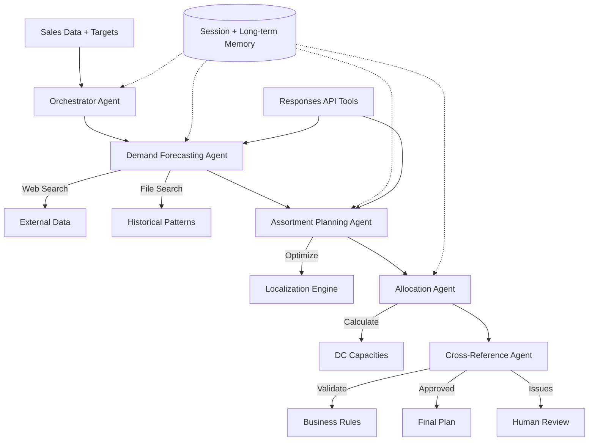

# OpenAI Agents SDK Research & PoC Recommendations for Retail Operations
**Date:** September 26, 2025
**Author:** Senior AI Systems Designer
**Audience:** Analytics team transitioning to agent frameworks for retail planning

---

## Executive Summary

**Problem:** Retail organizations face critical pain points in pre-season planning: forecast accuracy ranges from 60-85%, manual data consolidation takes 10-20 hours weekly, inventory misallocation leads to expensive cross-border transfers, and teams struggle to factor external economic conditions into predictions.

**Solution:** Deploy a multi-agent system using OpenAI's Agents SDK and Responses API to orchestrate demand forecasting, assortment planning, and allocation optimization, reducing forecast errors and planning cycle time while improving localization.

**Key Architecture:**
- **Orchestrator Agent** manages workflow and coordinates specialized agents
- **Demand Forecasting Agent** combines traditional ML with LLM reasoning for better predictions
- **Assortment Planning Agent** optimizes product mix based on local demand patterns
- **Allocation Agent** distributes inventory across stores/DCs to minimize transfers
- **Cross-Reference Agent** validates decisions against business rules and policies

**Implementation Timeline:** 1 week for basic PoC with synthetic retail data

**Expected Impact:**
- Improve forecast accuracy from 60-70% to 80-85%
- Reduce data consolidation time by 75% (20 hrs → 5 hrs weekly)
- Minimize inventory redistribution costs through better initial allocation
- Enable real-time adaptation to economic/policy changes

**Next Steps:** Build PoC with synthetic sales data, test forecast improvements, demonstrate agent coordination for complex planning scenarios.

---

## 1. Concepts: Workflow vs Agentic Systems

### Traditional Workflow
A **workflow** is a predefined sequence of steps executed in order:
- **Prompt Chaining:** Output of Step A feeds into Step B, then C
- **Gating:** Conditional branches (if X then Y, else Z)
- **Routing:** Direct traffic to different paths based on rules
- **Parallelization:** Run multiple independent tasks simultaneously
- **Orchestrator-Worker:** Central controller assigns tasks to specialized workers

**Limitation:** Workflows stop when they encounter unexpected situations. They cannot adapt or retry with different approaches.

### Agentic System
An **agent** can sense its environment, reason about it, take actions, and learn from results:
- **REACT Loop:** Reason → Act → Observe → Decide (repeat until goal achieved)
- **Autonomous Decision-Making:** Agent chooses next action based on current state
- **Tool Use:** Agent selects and uses tools (APIs, functions) as needed
- **Self-Correction:** Agent recognizes errors and adjusts approach
- **Memory:** Agent maintains context across interactions

**Key Difference:** When a workflow hits an error, it stops. When an agent hits an error, it reasons about alternatives and tries again.

### When to Use Each

**Use a Workflow when:**
- Process is well-defined and predictable (e.g., daily sales report generation)
- All edge cases are known upfront
- Speed and efficiency are paramount
- No adaptation needed during execution

**Use an Agent when:**
- Process requires judgment and adaptation (e.g., demand forecasting with external factors)
- Many edge cases or unknown scenarios
- Need to integrate multiple data sources dynamically
- Quality matters more than raw speed
- Knowledge needs to accumulate over time

**Retail Example:**
- **Workflow:** Generate weekly sales report from POS data
- **Agent:** Adjust forecast based on weather, economic indicators, and competitor actions

---

## 2. OpenAI Agents SDK & Responses API Overview

### OpenAI Agents SDK

The OpenAI Agents SDK (released 2024, production-ready) offers a minimal yet powerful set of primitives:

**Core Components:**
1. **Agents:** LLMs with instructions and tools
2. **Tools/Function-Calling:** APIs and functions agents can invoke
3. **Handoffs:** Delegation between specialized agents
4. **Sessions:** Automatic conversation history management
5. **Guardrails:** Input/output validation and safety checks

**How REACT Cycles Work:**
```
Retail Input → Agent Reasons → Selects Tool → Executes Action →
Observes Sales Data → Adjusts Forecast → (Repeat or Return)
```

### OpenAI Responses API (New in 2025)

The **Responses API** combines the simplicity of Chat Completions with the tool-use capabilities of Assistants API, specifically designed for building agents.

**Key Features:**
- **Built-in Tools:** Web search, file search, code interpreter, image generation
- **Background Mode:** Handle long-running tasks (perfect for batch forecasting)
- **Unified Design:** Simpler streaming events and SDK helpers
- **MCP Support:** Model Context Protocol for standardized context provision

**Why Use Responses API for Retail:**
- **Web Search:** Pull competitor pricing, economic indicators, weather data
- **File Search:** Query historical sales patterns, policy documents
- **Code Interpreter:** Run statistical models, data analysis on the fly
- **Background Processing:** Handle overnight batch forecasts without timeouts

### Comparison with Traditional Approaches

**vs Traditional ML Pipelines:**
- Traditional: Fixed feature engineering → Model → Output
- Agents: Dynamic feature discovery, reasoning about anomalies, self-correction

**vs RAG Pipelines:**
- RAG: Static retrieval → Generation
- Agents: Dynamic tool selection, multi-step reasoning, iterative refinement

**vs Legacy Agent Libraries (LangChain, AutoGen):**
- Legacy: Heavy abstractions, complex configurations
- OpenAI SDK: Lightweight, minimal abstractions, production-focused

### Key Concepts for Retail Use Case

**Memory Types:**
- **Short-term (Session):** Current planning cycle, seasonal trends, recent decisions
- **Long-term (Project):** Historical patterns, learned seasonality, supplier lead times

**Tools We'll Need:**
- **Data Extractors:** Pull from Retail Link, POS systems, Excel
- **Forecasting Models:** Time-series analysis, demand prediction
- **Optimization Engines:** Allocation algorithms, assortment planning
- **Policy Validators:** Business rule enforcement

**Handoff Pattern:**
- Orchestrator evaluates data → Hands off to Demand Forecaster
- Demand Forecaster generates predictions → Hands off to Assortment Planner
- Assortment Planner optimizes mix → Hands off to Allocation Agent
- Allocation Agent distributes → Hands off to Validator

---

## 3. Web Research & Citations

Based on current research (September 2025), here are the most relevant sources:

1. **OpenAI Agents SDK Documentation** (Updated: 2025)
   https://openai.github.io/openai-agents-python/
   Primary reference for SDK features and examples

2. **New Tools for Building Agents - OpenAI** (Published: 2025)
   https://openai.com/index/new-tools-for-building-agents/
   Responses API announcement and capabilities

3. **GitHub Repository - OpenAI Agents Python** (Active: 2025)
   https://github.com/openai/openai-agents-python
   Source code, examples, and community contributions

4. **Production-Ready Agents with OpenAI SDK + Temporal** (Published: 2025)
   https://temporal.io/blog/announcing-openai-agents-sdk-integration
   Integration patterns for long-running workflows

5. **OpenAI Platform Responses API Docs** (Current: 2025)
   https://platform.openai.com/docs/api-reference/responses
   Responses API technical documentation

**Note:** The SDK is stable but actively developed. The Responses API launched in March 2025 and has processed trillions of tokens. Both are production-ready.

---

## 4. Recommended PoC Architecture for Retail Operations

### Agents & Roles

**1. Orchestrator Agent**
- **Role:** Central coordinator managing the planning workflow
- **Instructions:** Route requests to appropriate specialized agents, manage dependencies, aggregate results
- **Tools:** Workflow manager, status tracker, result aggregator
- **Handoff:** Routes to specialized agents based on planning phase

**2. Demand Forecasting Agent**
- **Role:** Generate accurate demand predictions incorporating multiple factors
- **Instructions:** Combine historical sales, seasonality, promotions, weather, economic indicators
- **Tools:** Time-series models, web search (economic data), statistical analyzers
- **Handoff:** Passes forecasts to Assortment Planning Agent
- **Pain Points Addressed:**
  - Inaccurate traditional ML forecasting (INT-001)
  - Inability to factor external conditions (INT-001)
  - Swimwear demand volatility (INT-003)

**3. Assortment Planning Agent**
- **Role:** Optimize product mix for each location/channel
- **Instructions:** Balance growth targets with realistic demand, localize assortments
- **Tools:** Optimization algorithms, category analyzers, localization engine
- **Handoff:** Sends optimal assortments to Allocation Agent
- **Pain Points Addressed:**
  - Difficulty mapping national to local demand (INT-002)
  - New product performance unknowns (INT-003)

**4. Allocation Planning Agent**
- **Role:** Distribute inventory optimally across stores and DCs
- **Instructions:** Minimize future transfers, balance inventory levels, consider lead times
- **Tools:** Allocation optimizer, DC capacity checker, transfer cost calculator
- **Handoff:** Sends allocation plan to Cross-Reference Agent
- **Pain Points Addressed:**
  - Complex inventory redistribution (INT-001)
  - Store allocation mismatches (INT-003)
  - Cross-border transfer costs (INT-001)

**5. Cross-Reference Agent**
- **Role:** Validate all decisions against business rules and policies
- **Instructions:** Check for policy violations, supplier constraints, minimum orders
- **Tools:** Policy database, rule engine, conflict detector
- **Handoff:** Returns validated plan or flags issues
- **Pain Points Addressed:**
  - Manual consolidation errors (INT-002)
  - Cross-team alignment issues (INT-003)

### Using the Responses API

The Responses API enhances our agents with powerful built-in capabilities:

```python
# Example: Demand Forecasting Agent using Responses API
response = client.responses.create(
    model="gpt-4o",
    messages=[
        {"role": "system", "content": "You are a retail demand forecasting expert"},
        {"role": "user", "content": "Forecast Q4 demand for winter coats in Toronto"}
    ],
    tools=[
        {"type": "web_search"},  # Get weather predictions, economic data
        {"type": "file_search"},  # Query historical sales patterns
        {"type": "code_interpreter"}  # Run statistical models
    ],
    background=True  # Handle long-running forecast calculations
)
```

### Tools to Mock (PoC Stage)

```python
# Simplified tool signatures for PoC
def extract_pos_data(store_id, date_range):
    # Returns sales history from POS/Retail Link

def get_economic_indicators(region, metric):
    # Uses Responses API web search for real-time data

def run_forecast_model(historical_data, external_factors):
    # Combines traditional ML with LLM reasoning

def optimize_assortment(forecast, constraints):
    # Returns optimal product mix per location

def allocate_inventory(assortment, dc_capacity):
    # Returns store/DC allocation plan
```

### Memory Strategy

**Per Planning Cycle (Session):**
- Current forecasts and assumptions
- Assortment decisions and rationale
- Allocation adjustments made
- Policy conflicts encountered

**Cross-Cycle Learning (Persistent):**
- Forecast accuracy by category/location
- Successful assortment patterns
- Transfer patterns to avoid
- Seasonal adjustment factors

### What to Postpone

- Real-time POS integration
- Complex RL optimization
- Full ERP system integration
- Multi-currency handling
- Advanced promotion optimization

---

## 5. Flowcharts

### A. Workflow vs Agentic Comparison

```
TRADITIONAL WORKFLOW (Current State from Interviews):
Pull Data → Clean Excel → Run Forecast → [Low Accuracy] → Manual Override → STOP ❌
   ↓ (If forecast fails)
   Meeting to discuss → Gut-feel adjustments → Hope for the best

AGENTIC APPROACH (Proposed):
Pull Data → Agent Analyzes → Run Forecast → [Low Accuracy]
   ↓
Agent Reasons: "Forecast seems off, let me check external factors"
   ↓
Web Search (weather, economy) → Adjust Model → Re-forecast → [Still off?]
   ↓
Agent Reasons: "Historical pattern suggests promotion impact"
   ↓
Query Promo Calendar → Factor in Promotions → Generate Final Forecast ✓
```

### B. Proposed PoC Architecture



---

## 6. Mock Data & Evaluation Plan

### Mock Inputs (Based on Interview Pain Points)

**5 Synthetic Retail Scenarios:**
1. **Furniture Company (INT-001):** 1-year forecast for US/Canada with cross-border complexity
2. **Walmart Category (INT-002):** High-volume SKU allocation across 10,000 stores
3. **Fashion Retailer (INT-003):** Swimwear/lingerie with seasonal volatility
4. **Economic Shock:** Sudden tariff change requiring rapid reallocation
5. **New Product Launch:** No historical data, need to use similar products

**Sample Data Structure:**
```json
{
  "historical_sales": "3 years daily POS data",
  "store_hierarchy": "200 stores across regions",
  "product_catalog": "3,500 SKUs with attributes",
  "external_factors": {
    "weather": "temperature, precipitation forecasts",
    "economy": "GDP, unemployment, consumer confidence",
    "competition": "competitor pricing, promotions"
  },
  "constraints": {
    "dc_capacity": "per location limits",
    "min_orders": "supplier minimums",
    "lead_times": "6-month manufacturing"
  }
}
```

### Expected Outputs

**Integrated Planning Output:**
```json
{
  "forecast": {
    "accuracy": 0.82,
    "confidence_intervals": "per SKU-location",
    "external_factors_impact": "quantified"
  },
  "assortment": {
    "national_core": "500 SKUs",
    "regional_flex": "200 SKUs per region",
    "localization_score": 0.78
  },
  "allocation": {
    "initial_distribution": "per store/DC",
    "transfer_risk": "low/medium/high",
    "expected_stockouts": "2% of SKU-locations"
  },
  "validations": {
    "policy_compliance": "PASS",
    "conflicts_resolved": 3,
    "human_review_needed": ["new_product_X"]
  },
  "processing_time": "3 minutes for full cycle"
}
```

### Success Criteria (Tied to Interview Pain Points)

| Metric | Current | Target | Pain Point Addressed |
|--------|---------|--------|---------------------|
| Forecast Accuracy | 60-70% | 80-85% | INT-001: Traditional ML insufficient |
| Data Prep Time | 10-20 hrs/week | 2-5 hrs/week | INT-002: Manual consolidation |
| Localization Score | Manual/Limited | 75%+ automated | INT-002: National → local mapping |
| Transfer Frequency | High | 50% reduction | INT-001: Redistribution costs |
| Planning Cycle | 30-90 days | 15-30 days | INT-002: Long planning cycles |
| Swimwear Forecast | ±40% error | ±20% error | INT-003: Volatility handling |

### Test Protocol

**20-Case Validation Suite:**
1. **Baseline:** Run traditional forecast on historical data
2. **Agent Test:** Run same period with agent system
3. **Measure:**
   - Forecast accuracy (MAPE, WMAPE)
   - Processing time per planning cycle
   - Number of manual interventions needed
   - Cross-reference catches
4. **Stress Tests:**
   - Inject external shock (tariff change)
   - Remove 50% of historical data
   - Add 100 new SKUs with no history
5. **Agent Coordination:**
   - Track handoffs between agents
   - Measure memory utilization
   - Log reasoning chains
6. **Generate Report:**
   - Accuracy improvements by category
   - Time savings breakdown
   - Failure mode analysis

---

## 7. Risk, Ethics, and Operations

### Key Risks & Mitigations

**Hallucination in Forecasts**
- Risk: Agent invents trends not supported by data
- Mitigation: Require statistical validation, confidence intervals, human review for outliers

**Over-Automation of Strategic Decisions**
- Risk: Replacing merchandiser judgment on key assortments
- Mitigation: Keep human in loop for top 20% revenue items, new categories

**Data Quality Dependencies**
- Risk: Garbage in, garbage out with poor POS data
- Mitigation: Data quality checks, anomaly detection, fallback to simpler models

**Integration Complexity**
- Risk: Connecting to Retail Link, ERP, Excel workflows
- Mitigation: Start with CSV exports, batch processing, gradual integration

### Operational Considerations

**Monitoring:**
- Track forecast accuracy weekly
- Alert on significant deviations
- Dashboard for agent performance
- Log all external data fetches

**Human-in-the-Loop:**
- Merchandiser can override any recommendation
- Flagging system for unusual patterns
- Approval required for >$1M allocation changes
- Weekly review of agent decisions

**Audit Trail:**
- Log all forecasts with inputs used
- Track assortment decisions and rationale
- Store allocation calculations
- Enable replay for debugging

### Ethical Considerations

**Fairness:** Ensure allocation doesn't systematically disadvantage certain stores/regions
**Transparency:** Clear explanation of why certain allocation decisions were made
**Privacy:** No use of individual customer data, only aggregated sales
**Accountability:** Human oversight for all major planning decisions

---

## 8. Implementation Recommendations

### Week 1 Sprint Plan

**Day 1-2: Environment Setup**
- Install OpenAI Agents SDK
- Set up Responses API access
- Create synthetic retail datasets
- Build agent skeletons

**Day 3-4: Core Agent Development**
- Implement Orchestrator with workflow logic
- Build Demand Forecasting with Responses API tools
- Create Assortment Planner with optimization

**Day 5-6: Integration & Testing**
- Add Allocation Agent
- Implement Cross-Reference validation
- Wire agent handoffs
- Test with mock data

**Day 7: Evaluation & Demo**
- Run 20-case validation suite
- Calculate metrics vs baseline
- Prepare stakeholder demo
- Document learnings

### Critical Success Factors

1. **Start with One Category:** Pick furniture OR fashion, not both
2. **Use Real Patterns:** Base synthetic data on interview insights
3. **Show the Reasoning:** Make agent decision process transparent
4. **Measure Impact:** Tie every metric to a real pain point
5. **Plan for Scale:** Design can handle Walmart-size eventually

### Integration with Existing Tools

Based on interviews, we need to consider:
- **Retail Link (INT-002):** Start with exports, plan for API
- **Excel Models (INT-003):** Import existing logic where valuable
- **Planning Platforms:** Design for coexistence, not replacement

---

## Conclusion

The OpenAI Agents SDK combined with the new Responses API provides the ideal foundation for addressing the critical pain points identified in our retail interviews. The ability to combine traditional forecasting with LLM reasoning, web search for external factors, and coordinated multi-agent planning directly addresses the limitations of current systems.

Our proposed architecture—Orchestrator → Demand Forecasting → Assortment → Allocation → Validation—maps directly to the retail planning workflow while adding the intelligence and adaptability that current systems lack. The Responses API's built-in tools (web search, file search, code interpreter) eliminate the need to build these capabilities from scratch.

**Key Advantages:**
- **Accuracy:** LLM reasoning + external data = better forecasts
- **Speed:** Parallel agent processing reduces cycle time
- **Adaptability:** Agents adjust to new patterns automatically
- **Scalability:** Same system works for 200 or 10,000 stores

**Immediate Value:**
- Week 1: Working PoC demonstrating concept
- Month 1: Refined system with real data testing
- Quarter 1: Production pilot with one category
- Year 1: Full deployment across categories

**Next Steps:**
1. Approve architecture and scope
2. Prioritize which retailer scenario to model first
3. Begin synthetic data generation
4. Start Day 1 implementation

This is not just about automation—it's about augmenting human planners with AI that can process more data, consider more factors, and adapt more quickly than traditional systems. The combination of OpenAI's Agents SDK and Responses API makes this vision achievable today.